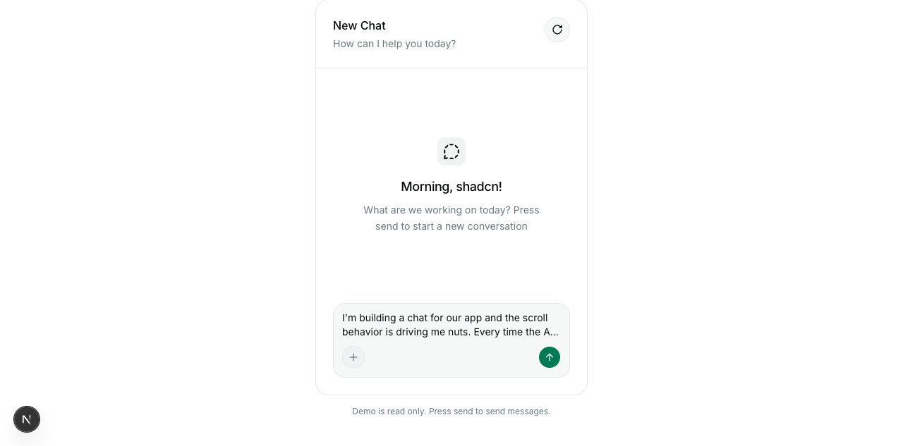
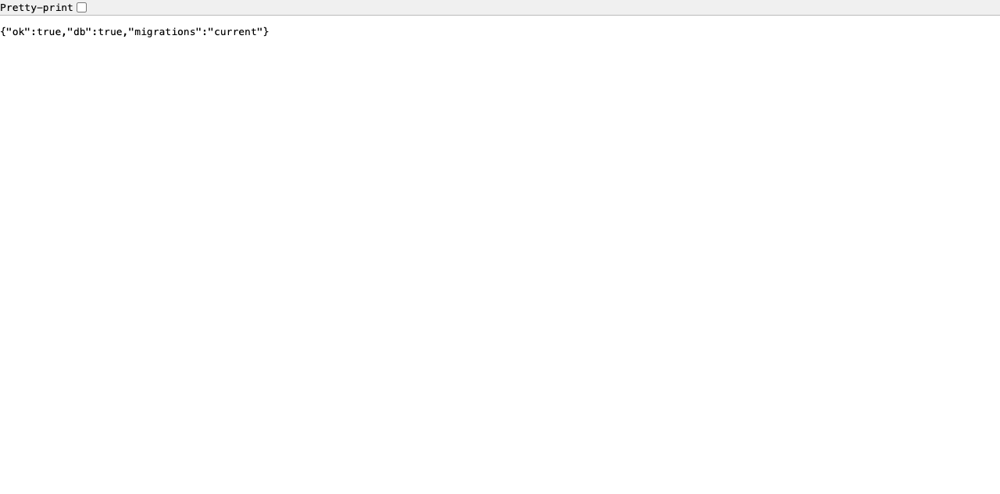

# Phase 0r — Verification packet

**Story under test:** US-A1 — Seeded workspace on first run
**Verified:** 2026-07-28 · branch `phase-0r-remediation` · Node v24.10.0 · Next 16.2.6 (Turbopack) · eve 0.27.8 · agent-browser 0.33.1 (pinned) · Neon Postgres
**Overall verdict: PARTIAL — 4 of 5 acceptance criteria pass, 1 is blocked (no task-creation surface exists in this phase).**

Phase 0r ships no product features, so US-A1 was re-verified end to end against a real, genuinely empty
database rather than re-asserted from the Phase 0 packet. Phase 0's own caveat was that it could only
observe the empty→seeded transition inside a rolled-back transaction; Phase 0r's new `scripts/reset.ts`
removes that limitation, so this run **actually dropped the schema of the separate test Neon project,
re-applied migrations, left it with zero rows, and then booted the app at it** — the seed we observe is
the app's own boot hook doing the work, persisted, not a simulation. The workspace that appeared contains
exactly one project ("Personal") with statuses **To Do / In Progress / Done** (Done completed) and
priorities **Low / Medium / High** (Medium default), in that order; restarting the server and reopening
the page left the state byte-identical, down to the project id and `created_at`. `GET /api/health`
answered `{"ok":true,"db":true,"migrations":"current"}` at HTTP 200 throughout, and every browser step ran
through the pinned `agent-browser` in an isolated session. The criterion that does **not** pass is
**US-A1.4** — "a task can be created … through either the UI or the agent". Neither surface exists yet
(no task components, no task route, no `agent/tools/`), and the live agent said so itself when asked to
create one. It is recorded as **blocked**, not as a pass.

Read [Method and caveats](#method-and-caveats) before treating the pass marks as unqualified — in
particular, the app under test was pointed at the **test** database, not the dev one.

---

## Results

| # | Story | Acceptance criterion (verbatim) | Result | Evidence |
|---|---|---|---|---|
| A1.1 | US-A1 | Given a fresh install with no data, when the app is opened, then exactly one project exists (e.g., "Personal"). | **pass** | [`a1-02-empty-database.txt`](./a1-02-empty-database.txt), [`a1-03-app-boot-and-health.txt`](./a1-03-app-boot-and-health.txt), [`a1-04-app-opened.png`](./a1-04-app-opened.png), [`a1-07-seeded-after-open.txt`](./a1-07-seeded-after-open.txt) |
| A1.2 | US-A1 | The seeded project has statuses **To Do**, **In Progress**, **Done** in that order, with *Done* flagged as completed. | **pass** | [`a1-07-seeded-after-open.txt`](./a1-07-seeded-after-open.txt), [`a1-01-fresh-install-reset.txt`](./a1-01-fresh-install-reset.txt), [`a1-13-defaults-unit-test.txt`](./a1-13-defaults-unit-test.txt) |
| A1.3 | US-A1 | The seeded project has priorities **Low**, **Medium**, **High** in that order, with *Medium* designated as the default. | **pass** | [`a1-07-seeded-after-open.txt`](./a1-07-seeded-after-open.txt), [`a1-01-fresh-install-reset.txt`](./a1-01-fresh-install-reset.txt), [`a1-13-defaults-unit-test.txt`](./a1-13-defaults-unit-test.txt) |
| A1.4 | US-A1 | A task can be created in the seeded project immediately, through either the UI or the agent, with no additional setup. | **blocked** — no task UI, no task route and no agent tools exist in Phase 0r; the criterion cannot be exercised | [`a1-09-no-task-surface.txt`](./a1-09-no-task-surface.txt), [`a1-08-agent-task-attempt.txt`](./a1-08-agent-task-attempt.txt), [`a1-04-app-opened.png`](./a1-04-app-opened.png) |
| A1.5 | US-A1 | Seeding happens exactly once — reopening the app does not create duplicate starter projects. | **pass** | [`a1-10-reopen-idempotent.txt`](./a1-10-reopen-idempotent.txt), [`a1-11-app-reopened.png`](./a1-11-app-reopened.png), [`a1-12-state-diff.txt`](./a1-12-state-diff.txt) |

Phase 0r's own exit criteria, separately (captured during implementation, files `01`–`11`):

| Exit criterion | Result | Evidence |
|---|---|---|
| `pnpm test:unit` green via `node --test` | **pass** | [`02-node-test.txt`](./02-node-test.txt), re-run today as [`a1-13-defaults-unit-test.txt`](./a1-13-defaults-unit-test.txt) |
| `GET /api/health` returns `{ok:true, db:true, migrations:"current"}` | **pass** | [`05-api-health.txt`](./05-api-health.txt), re-run today as [`a1-03-app-boot-and-health.txt`](./a1-03-app-boot-and-health.txt) and [`a1-06-health.png`](./a1-06-health.png) |
| agent-browser drives the running app and returns a snapshot and a screenshot | **pass** | [`09-agent-browser-doctor.txt`](./09-agent-browser-doctor.txt), [`a1-05-browser-snapshot.txt`](./a1-05-browser-snapshot.txt), [`a1-04-app-opened.png`](./a1-04-app-opened.png) |
| package.json contains no dependency outside §1.1 | **pass** | [`01-dependencies.txt`](./01-dependencies.txt) |

---

## A1.1 — Exactly one project on a fresh install

**Step 1 — a real fresh install.** `docs/verification/phase-0r/harness/fresh-install.ts` drops the
`public` and `drizzle` schemas of the test Neon project, re-applies the migrations through the repo's own
`runMigrations()`, and deliberately does **not** seed, so the app boot is what has to create the workspace
— [`a1-02-empty-database.txt`](./a1-02-empty-database.txt):

```
Dropped the public and drizzle schemas.
Applied migrations to ep-TEST-ENDPOINT-REDACTED.c-10.us-east-1.aws.neon.tech/neondb.
NOT seeded — the app boot is what must create the workspace.
counts -> { projects: '0', statuses: '0', priorities: '0', tasks: '0' }

== before the app is opened — …/neondb (test) ==
every project row -> Result(0) []
{ "project": null, "statuses": [], "priorities": [] }
```

**Step 2 — open the app.** `next dev` on port 3100 against that empty database. The boot hook
(`instrumentation.ts`) seeds, and the readiness probe reports a migrated, reachable database —
[`a1-03-app-boot-and-health.txt`](./a1-03-app-boot-and-health.txt):

```
▲ Next.js 16.2.6 (Turbopack)  - Local: http://localhost:3100   ✓ Ready in 154ms
[eve:dev] server listening at http://127.0.0.1:61340/
[seed] created the default project and its lists

$ curl -i -s http://localhost:3100/api/health
HTTP/1.1 200 OK
{"ok":true,"db":true,"migrations":"current"}
```

The page itself, opened and photographed through the pinned agent-browser
([`a1-04-app-opened.png`](./a1-04-app-opened.png)). Expected content at this phase is Phase 0's
placeholder chat demo — Phase 0r adds no UI:



`GET /api/health` rendered in the same browser session ([`a1-06-health.png`](./a1-06-health.png)):



**Step 3 — count the projects.** [`a1-07-seeded-after-open.txt`](./a1-07-seeded-after-open.txt), read back
after the page was open:

```
== after the app was opened in the browser — …/neondb (test) ==
counts -> { projects: '1', statuses: '3', priorities: '3', tasks: '0' }
every project row -> Result(1) [
  { id: '0d973913-c1e3-4430-bcfa-81e8709dfefd', name: 'Personal',
    created_at: '2026-07-28 16:27:14.490815+00' }
]
```

Exactly one project, named "Personal", created by opening the app on an empty database. **Pass.**

## A1.2 — Statuses To Do / In Progress / Done, Done completed

Same dump, [`a1-07-seeded-after-open.txt`](./a1-07-seeded-after-open.txt) (`order` is the physical
`sort_order` column, read back ascending):

```json
"statuses": [
  { "name": "To Do",       "order": 0, "isCompleted": false },
  { "name": "In Progress", "order": 1, "isCompleted": false },
  { "name": "Done",        "order": 2, "isCompleted": true  }
]
```

The independent `pnpm db:reset:test` run in [`a1-01-fresh-install-reset.txt`](./a1-01-fresh-install-reset.txt)
produced the identical three rows through the CLI path, and the unit suite pins the source of truth,
`lib/domain/defaults.ts` — [`a1-13-defaults-unit-test.txt`](./a1-13-defaults-unit-test.txt):

```
▶ default statuses
  ✔ is exactly To Do, In Progress, Done in that order
  ✔ marks Done, and only Done, as completed
  ✔ puts the first status, the one new tasks take, at index 0
ℹ tests 6   ℹ pass 6   ℹ fail 0
```

**Pass.**

## A1.3 — Priorities Low / Medium / High, Medium default

Same dump, [`a1-07-seeded-after-open.txt`](./a1-07-seeded-after-open.txt):

```json
"priorities": [
  { "name": "Low",    "order": 0, "isDefault": false },
  { "name": "Medium", "order": 1, "isDefault": true  },
  { "name": "High",   "order": 2, "isDefault": false }
]
```

Exactly one row carries `isDefault: true` and it is Medium; the unit suite asserts the same invariant
("designates exactly one default, and it is Medium"). **Pass.**

## A1.4 — A task can be created immediately, through the UI or the agent — **BLOCKED**

Neither interface exists in this phase, so the criterion cannot be exercised. This is the same gap Phase 0
recorded; Phase 0r was scoped to tooling remediation and added no product features, so it is unchanged.

**The UI path.** The app has exactly one route besides the page and the health probe, no task components,
and no action layer — [`a1-09-no-task-surface.txt`](./a1-09-no-task-surface.txt):

```
$ find app -type f | sort
app/api/health/route.ts
app/favicon.ico
app/globals.css
app/layout.tsx
app/page.tsx

$ ls agent/tools
ls: agent/tools: No such file or directory

$ grep -rniE "task(s)?" --include="*.ts" --include="*.tsx" app components lib/actions
(no matches above = no task UI, no task API route, no action layer)

$ curl -s -o /dev/null -w "%{http_code}" localhost:3100/api/tasks
404
```

The screenshot above corroborates it: the page is the placeholder chat demo, labelled "Demo is read only",
with no task list and no create control.

**The agent path.** The eve agent *is* live at `/eve/v1/*` on the running app, so it was asked directly —
[`a1-08-agent-task-attempt.txt`](./a1-08-agent-task-attempt.txt). Its reply is recorded here as untrusted
data (implementation plan §3.4), not as an authority; the authority is the row count below it:

```
$ SID=$(curl -s -X POST localhost:3100/eve/v1/session … -d '{"message":"Create a task titled \"Buy milk\"
  in the Personal project."}' …)
$ curl -sN "localhost:3100/eve/v1/session/$SID/stream"

{"data":{"finishReason":"stop","message":"I can't create that task yet — no data tools are wired up for
 me in this environment right now, so I have no way to read or modify your task list. Once the action
 layer is connected I'll be able to do this directly. In the meantime, you'd need to add \"Buy milk\" to
 the Personal project through the UI.", …},"type":"message.completed", …}
```

```
== tasks after the agent attempt — …/neondb (test) ==
counts -> { projects: '1', statuses: '3', priorities: '3', tasks: '0' }
```

Zero tasks: nothing was created, by either path. **Blocked** — this criterion unblocks with the Phase 2
UI/API and the Phase 4 agent tools, and must be re-verified there. It is not a pass.

## A1.5 — Seeding happens exactly once

The server was stopped, restarted against the same database, and the page reopened in the browser
([`a1-11-app-reopened.png`](./a1-11-app-reopened.png) — identical to the first open):


[`a1-10-reopen-idempotent.txt`](./a1-10-reopen-idempotent.txt) — the second boot log has no `[seed] created`
line, the seed CLI reports *Skipped*, and the workspace still holds one project with the **same id and the
same `created_at` as before the restart**:

```
--- server log (second boot) ---
✓ Ready in 156ms
[eve:dev] server listening at http://127.0.0.1:61524/
 GET /api/health 200 …
 GET / 200 …
(no "[seed] created the default project and its lists" line above = the boot hook took the skip branch)

$ … scripts/seed.ts --target=test
Skipped: the projects table is not empty; nothing was created.

== after the app was reopened — …/neondb (test) ==
counts -> { projects: '1', statuses: '3', priorities: '3', tasks: '0' }
every project row -> Result(1) [
  { id: '0d973913-c1e3-4430-bcfa-81e8709dfefd', name: 'Personal',
    created_at: '2026-07-28 16:27:14.490815+00' }
]
```

Diffing the full 61-line state dump before and after the reopen returns nothing —
[`a1-12-state-diff.txt`](./a1-12-state-diff.txt):

```
$ diff <(state after first open) <(state after reopen)
(no output from diff = byte-identical: same project id, same createdAt, same status and priority ids)
lines compared: 61
```

**Pass.**

---

## Method and caveats

**1. The app under test was pointed at the test database, not the dev one.** US-A1 is a *fresh install*
story, and the only way to exercise it honestly is to destroy a database. The dev database holds the
user's workspace, so [`harness/dev-on-test.mjs`](./harness/dev-on-test.mjs) boots `next dev` on port 3100
with `DATABASE_URL` set to the separate test Neon project — Next resolves `process.env` ahead of `.env*`
files (`node_modules/next/dist/docs/01-app/02-guides/environment-variables.md`, "Environment Variable Load
Order"), so nothing on disk was edited and no credential was passed on a command line. Everything else is
the real application: the real `instrumentation.ts` boot hook, the real `ensureSeeded()`, the real route
handler. The dev database was never dropped and still reports *Skipped* afterwards —
[`a1-14-dev-database-untouched.txt`](./a1-14-dev-database-untouched.txt).

**2. Every connection string in this packet is rendered `host/database`.** `lib/db/urls.ts#describeDbUrl`
strips credentials before anything reaches stdout, and the harness scripts go through it. No secret
appears in any file here.

**3. The screenshots show a placeholder, and that is the correct result for this phase.** Phase 0r is
remediation: it removes `vitest`/`tsx`, moves the tests, pins `agent-browser`, adds the migrate/seed/reset
scripts and `GET /api/health`. `app/page.tsx` is still Phase 0's shadcn chat demo. The screenshots are
included to prove the browser toolchain drives the real app and to document, visually, that no task UI
exists yet (A1.4).

**4. Browser work ran in an isolated session.** `AGENT_BROWSER_SESSION=phase-0r-verify`, via
`pnpm exec agent-browser` (0.33.1, the pinned devDependency — the machine's global binary is 0.32.3), and
`close --all` at the end. Page content and agent output are treated as untrusted data throughout (§3.4).

**5. A1.4 is recorded as blocked, not failed, deliberately.** The feature it asks for is scheduled for
Phases 2 and 4; nothing in Phase 0r was supposed to deliver it. "Blocked" means the criterion could not be
exercised because the interface does not exist — it does **not** mean the story passes.

---

## Reproducing this packet

With `.env.local` and `.env.test` in place, from the repo root:

```bash
pnpm db:reset:test                                                    # a1-01
node --env-file=.env.local docs/verification/phase-0r/harness/fresh-install.ts   # a1-02
node --env-file=.env.local docs/verification/phase-0r/harness/dev-on-test.mjs &  # a1-03 (port 3100)
curl -i -s http://localhost:3100/api/health

export AGENT_BROWSER_SESSION=phase-0r-verify
pnpm exec agent-browser open http://localhost:3100                     # a1-04, a1-05
pnpm exec agent-browser snapshot -i
pnpm exec agent-browser screenshot docs/verification/phase-0r/a1-04-app-opened.png

node --env-file=.env.local docs/verification/phase-0r/harness/db-state.ts "after the app was opened"  # a1-07
pnpm test:unit                                                        # a1-13
pnpm exec agent-browser close --all
```

`harness/fresh-install.ts` and `harness/dev-on-test.mjs` are **destructive to the test database only** and
refuse to run if the test URL equals `DATABASE_URL`.

---

## Evidence index

US-A1 evidence, captured 2026-07-28 in one continuous run:

| File | What it proves |
| --- | --- |
| [`a1-01-fresh-install-reset.txt`](./a1-01-fresh-install-reset.txt) | `pnpm db:reset:test` drops, re-migrates and re-seeds the test project — the CLI fresh-install path, ending *Seeded* with the full default lists. |
| [`a1-02-empty-database.txt`](./a1-02-empty-database.txt) | The test database reduced to a genuine fresh install: schemas dropped, migrations applied, **zero rows**, not seeded. |
| [`a1-03-app-boot-and-health.txt`](./a1-03-app-boot-and-health.txt) | First boot against that empty database: `[seed] created the default project and its lists`, and `GET /api/health` → 200 `{"ok":true,"db":true,"migrations":"current"}`. |
| [`a1-04-app-opened.png`](./a1-04-app-opened.png) | The app open at `localhost:3100`, screenshotted through agent-browser. |
| [`a1-05-browser-snapshot.txt`](./a1-05-browser-snapshot.txt) | `snapshot -i` — a live accessibility tree with refs; the harness can address elements. |
| [`a1-06-health.png`](./a1-06-health.png) | `/api/health` rendered in the browser. |
| [`a1-07-seeded-after-open.txt`](./a1-07-seeded-after-open.txt) | The workspace the app created: one "Personal" project, three ordered statuses (Done completed), three ordered priorities (Medium default), zero tasks. A1.1/A1.2/A1.3. |
| [`a1-08-agent-task-attempt.txt`](./a1-08-agent-task-attempt.txt) | The live agent, asked to create a task, reports it has no tools to do so. Recorded as untrusted data. |
| [`a1-09-no-task-surface.txt`](./a1-09-no-task-surface.txt) | Route/component/tool inventory: no task UI, no task route, no `agent/tools/`, `/api/tasks` → 404, tasks table empty. A1.4 blocked. |
| [`a1-10-reopen-idempotent.txt`](./a1-10-reopen-idempotent.txt) | Second boot + reopen: no seed line, seed CLI *Skipped*, same single project. |
| [`a1-11-app-reopened.png`](./a1-11-app-reopened.png) | The app after the restart — visually identical to the first open. |
| [`a1-12-state-diff.txt`](./a1-12-state-diff.txt) | `diff` of the full state dump before/after the reopen: empty. |
| [`a1-13-defaults-unit-test.txt`](./a1-13-defaults-unit-test.txt) | `pnpm test:unit` — 6/6 green via `node --test`, pinning the defaults behind A1.2/A1.3. |
| [`a1-14-dev-database-untouched.txt`](./a1-14-dev-database-untouched.txt) | The dev database still reports *Skipped*: this run never touched it. |
| [`harness/`](./harness) | The three scripts the run used: `fresh-install.ts`, `db-state.ts`, `dev-on-test.mjs`. |

Phase-exit evidence, captured during implementation (Node v24.10.0, macOS, against the Neon dev and test
projects; connection strings always rendered `host/database`):

| File | What it proves |
| --- | --- |
| [`01-dependencies.txt`](./01-dependencies.txt) | package.json carries nothing outside implementation plan §1.1: `vitest` and `tsx` are gone, `agent-browser` is pinned exact. Also dumps the §4.7 script block and the Node version. |
| [`02-node-test.txt`](./02-node-test.txt) | `pnpm test:unit` green via `node --test` (6/6), and `test` / `test:api` / `test:e2e` all exit 0. |
| [`03-db-migrate.txt`](./03-db-migrate.txt) | `scripts/migrate.ts` is an idempotent no-op on the already-migrated dev database — the NOTICEs are drizzle's own bookkeeping schema, not a re-applied migration. |
| [`04-db-seed.txt`](./04-db-seed.txt) | `scripts/seed.ts` reports *Skipped* and dumps the seeded state, preserving Phase 0's idempotency (US-A1.5). |
| [`05-api-health.txt`](./05-api-health.txt) | `GET /api/health` returns `{"ok":true,"db":true,"migrations":"current"}` with HTTP 200 — the §2.7 exit criterion. |
| [`06-db-reset-test.txt`](./06-db-reset-test.txt) | `pnpm db:reset:test` runs the full destructive drop → migrate → seed against the **test** project, ending *Seeded*. The dev database was never dropped. |
| [`07-reset-guard.txt`](./07-reset-guard.txt) | The reset guard refuses, non-destructively and with exit 1, when the test URL equals `DATABASE_URL`. Run against fake URLs in a throwaway env file, so no real credential was involved. |
| [`08-db-seed-dev-after.txt`](./08-db-seed-dev-after.txt) | The dev database still reports *Skipped* after the test-database reset — the two are genuinely separate projects. |
| [`09-agent-browser-doctor.txt`](./09-agent-browser-doctor.txt) | The pinned `agent-browser` (0.33.1, via `pnpm exec`) passes `doctor` 8/8, including a real headless Chrome launch. |
| [`10-app-screenshot.png`](./10-app-screenshot.png) | The running app, rendered and screenshotted through agent-browser during implementation. |
| [`11-agent-browser-snapshot.txt`](./11-agent-browser-snapshot.txt) | `snapshot -i` returns a live accessibility tree with refs, proving the harness can address elements. |
