# Phase 3 verification packet — Task UI + list management

**Scope:** Epics B, C, D and E — US-B1…B6, US-C1…C3, US-D1…D2, US-E1…E2.
**Verdict: PASS.** All 45 acceptance criteria across the 13 stories in scope were
exercised against a running instance of the app and all 45 pass. Nothing was
skipped, nothing is blocked, and no criterion is being reported on the strength
of source code alone — every row below is backed by a screenshot of the state
*after* the action, a transcript of a live HTTP response, or both. Two
non-blocking behavioural observations surfaced along the way (a create field
that keeps its text after a successful submit, and filter state that resets when
the tab is switched); neither is required or forbidden by any criterion in
scope, and both are recorded in [Observations](#observations-not-acceptance-criteria)
rather than quietly dropped. The phase's own exit criterion was also re-tested
independently: `pnpm test:e2e` was run fresh from a `next build`, and all 47
browser tests pass against the production server.

---

## How this was verified

Everything in this packet was produced on **2026-07-28** by driving a real
Chromium instance with `agent-browser` (isolated session `phase-3-verify`)
against a dev server the verifier started on port 3100:

```bash
pnpm db:reset                 # drop → migrate → seed, so the run starts from the documented first-run state
PORT=3100 pnpm dev            # Next.js 16.2.6, DATABASE_URL = the Neon dev branch
export AGENT_BROWSER_SESSION=phase-3-verify
agent-browser open http://localhost:3100
```

The workspace was built up **through the UI itself**, in the order the stories
appear — no fixtures, no direct database writes. So the state each screenshot
shows is state the UI produced. Row counts, chip text, `<select>` option lists,
`data-completed` / `data-default` attributes and error strings were additionally
read back out of the live DOM (`agent-browser eval`) so that a claim like
"sorted highest priority first" is anchored to the actual rendered order and not
to a reading of the picture.

Three things a screenshot cannot show are captured as transcripts instead:

| File | What it proves |
| --- | --- |
| [`transcript-api-guards.txt`](./transcript-api-guards.txt) | The server-side half of US-B1.2, US-B1.5 and US-B4.4 — the cases the UI makes unreachable |
| [`transcript-scoped-lists.txt`](./transcript-scoped-lists.txt) | Native `<select>` option lists (popups do not render into screenshots) for US-B1.5, US-B4.3/4.4 and US-B5.2 |
| [`transcript-console-and-errors.txt`](./transcript-console-and-errors.txt) | Plan §3.1 hygiene: `agent-browser errors` empty, console free of warnings and errors |

Finally, the whole E2E suite was re-run from a clean `next build`, independently
of the implementation session — **47 tests, 47 pass, 0 fail, 0 skipped**, exit
code 0, 5m09s, against `next start` and the separate `DATABASE_URL_TEST` Neon
project. Full output in [`transcript-e2e-run.txt`](./transcript-e2e-run.txt).
That is the phase's stated exit criterion ("demonstrated by those E2E files
passing against a PRODUCTION build, not by hand-clicking") met on its own terms;
the browser evidence below is the human-readable corroboration of it.

**Workspace at the end of the run** (the state most later screenshots share):

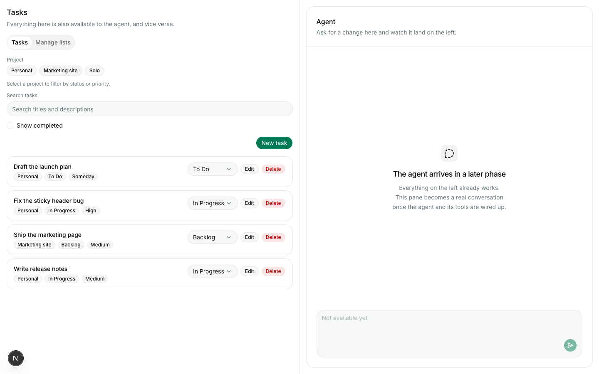

| Project | Statuses | Priorities |
| --- | --- | --- |
| Personal | To Do, In Progress, Done *(completed)* | Medium *(default)*, High, Someday |
| Marketing site | Backlog, Blocked, In Progress, Done *(completed)* | Low, Medium *(default)*, High |
| Solo | To Do | Low *(default)* |

Every one of those non-default names and orders was produced by an action in
this packet, which is why the per-project independence rules (US-D1.1, US-E1.1)
can be read straight off the table.

---

## Results at a glance

| Story | Criteria | Result |
| --- | --- | --- |
| [US-B1 Create a task](#us-b1--create-a-task) | 6 | 6 pass |
| [US-B2 View and browse tasks](#us-b2--view-and-browse-tasks) | 5 | 5 pass |
| [US-B3 Filter and search tasks](#us-b3--filter-and-search-tasks) | 5 | 5 pass |
| [US-B4 Edit a task](#us-b4--edit-a-task) | 5 | 5 pass |
| [US-B5 Move a task's status](#us-b5--move-a-tasks-status) | 4 | 4 pass |
| [US-B6 Delete a task](#us-b6--delete-a-task) | 3 | 3 pass |
| [US-C1 Create a project](#us-c1--create-a-project) | 3 | 3 pass |
| [US-C2 Rename a project](#us-c2--rename-a-project) | 2 | 2 pass |
| [US-C3 Delete a project](#us-c3--delete-a-project) | 3 | 3 pass |
| [US-D1 Manage statuses](#us-d1--manage-statuses) | 4 | 4 pass |
| [US-D2 Delete a status](#us-d2--delete-a-status) | 3 | 3 pass |
| [US-E1 Manage priorities](#us-e1--manage-priorities) | 4 | 4 pass |
| [US-E2 Delete a priority](#us-e2--delete-a-priority) | 4 | 4 pass |
| **Total** | **45** | **45 pass / 0 fail / 0 blocked** |

---

# Epic B — Task Management (Direct UI)

## US-B1 — Create a task

| # | Criterion (verbatim) | Result | Evidence |
| --- | --- | --- | --- |
| B1.1 | I can create a task by providing a title and selecting a project; description, status, and priority are optional inputs. | **pass** | [us-b1-1-create-form-fields.png](./us-b1-1-create-form-fields.png) |
| B1.2 | A task cannot be created without a title or without a project. | **pass** | [us-b1-2-title-required.png](./us-b1-2-title-required.png), [transcript-api-guards.txt](./transcript-api-guards.txt) |
| B1.3 | When status is omitted, the task gets the project's first status by order. | **pass** | [us-b1-3-4-6-defaults-applied.png](./us-b1-3-4-6-defaults-applied.png) |
| B1.4 | When priority is omitted, the task gets the project's default priority. | **pass** | [us-b1-3-4-6-defaults-applied.png](./us-b1-3-4-6-defaults-applied.png), [us-e1-3-new-task-takes-default.png](./us-e1-3-new-task-takes-default.png) |
| B1.5 | Only statuses and priorities belonging to the selected project are offered/accepted. | **pass** | [us-b1-5-project-scoped-form.png](./us-b1-5-project-scoped-form.png), [transcript-scoped-lists.txt](./transcript-scoped-lists.txt), [transcript-api-guards.txt](./transcript-api-guards.txt) |
| B1.6 | The new task appears in the task list immediately after creation. | **pass** | [us-b1-3-4-6-defaults-applied.png](./us-b1-3-4-6-defaults-applied.png) |

### B1.1 — title + project required, the rest optional

The dialog's own subtitle states the rule, and Status and Priority both default
to a `Project default` sentinel rather than to a concrete value — which is what
makes them optional *inputs* rather than pre-filled ones.

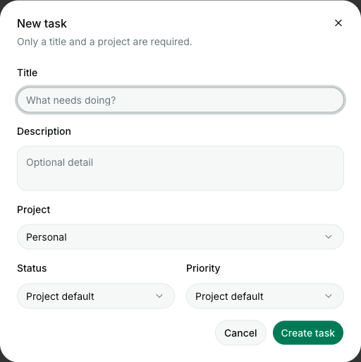

### B1.2 — neither a title nor a project can be omitted

Submitting with an empty title is refused in the dialog, inline, with the task
not created:

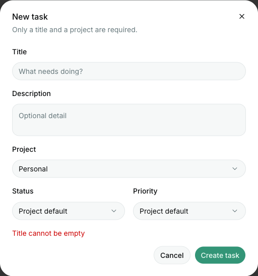

The project half of the criterion cannot be produced through the UI at all — the
Project control is a `<select>` with no empty option, so there is no state in
which a user can submit without one. The rule is therefore verified where it can
be violated, at the API (`transcript-api-guards.txt`):

```
$ curl -X POST /api/tasks -d '{"title":"No project"}'
{"error":"Invalid request.","issues":[{"expected":"string","code":"invalid_type","path":["projectId"],
 "message":"Invalid input: expected string, received undefined"}]}
HTTP 400

$ curl -X POST /api/tasks -d '{"title":"Null project","projectId":null}'
HTTP 400
```

### B1.3 / B1.4 / B1.6 — omitted status and priority take the project's defaults

"Draft the launch plan" was created with a title and nothing else. It appears in
the list without a reload, tagged **To Do** (Personal's first status by order)
and **Medium** (Personal's default priority).

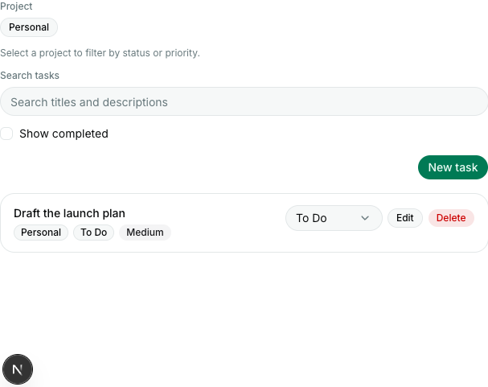

B1.4 is independently re-confirmed under [US-E1.3](#e13--exactly-one-default-and-a-new-task-takes-it),
where the default is moved to a different priority and the *next* task created
picks up the new one.

### B1.5 — only the selected project's lists are offered, and only they are accepted

Switching the Project select re-scopes both other selects. Read out of the live
DOM (full listing in `transcript-scoped-lists.txt`):

```
Personal        statuses ["Project default","To Do","In Progress","Done"]
                priorities ["Project default","Medium","High","Someday"]
Marketing site  statuses ["Project default","Backlog","Blocked","In Progress","Done"]
                priorities ["Project default","Low","Medium","High"]
Solo            statuses ["Project default","To Do"]
                priorities ["Project default","Low"]
```

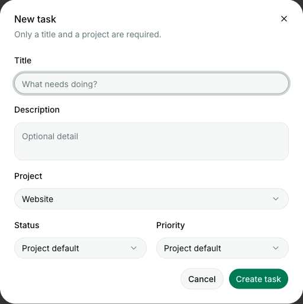

"Accepted" is the server's half, and it is enforced there too — posting a
Personal task with a Marketing site status or priority is refused:

```
{"error":"Status 'Backlog' belongs to a different project. A task in 'Personal' can only use that project's own statuses."}
HTTP 409
{"error":"Priority 'Low' belongs to a different project. A task in 'Personal' can only use that project's own priorities."}
HTTP 409
```

---

## US-B2 — View and browse tasks

| # | Criterion (verbatim) | Result | Evidence |
| --- | --- | --- | --- |
| B2.1 | The task list shows each task's title, project, status, and priority (status/project/priority rendered as tags/chips). | **pass** | [us-b2-1-2-list-chips-and-sort.png](./us-b2-1-2-list-chips-and-sort.png) |
| B2.2 | Open tasks sort by priority (highest first), then creation date (oldest first). | **pass** | [us-b2-1-2-list-chips-and-sort.png](./us-b2-1-2-list-chips-and-sort.png) |
| B2.3 | Tasks in completed statuses are hidden by default and revealed by a "show completed" toggle/filter. | **pass** | [us-b2-3-b5-3-completed-hidden.png](./us-b2-3-b5-3-completed-hidden.png), [us-b2-3-4-completed-shown-last.png](./us-b2-3-4-completed-shown-last.png) |
| B2.4 | When shown, completed tasks appear below open tasks and are visually distinct. | **pass** | [us-b2-3-4-completed-shown-last.png](./us-b2-3-4-completed-shown-last.png) |
| B2.5 | Opening a task shows all of its fields, including its full description. | **pass** | [us-b2-5-b4-4-open-task-all-fields.png](./us-b2-5-b4-4-open-task-all-fields.png) |

### B2.1 / B2.2 — chips, and the sort order

Four tasks created in this order: *Draft the launch plan* (Medium), *Fix the
header bug* (High), *Write release notes* (Medium), *Archive old notes* (Low).
The rendered order is High → Medium → Medium → Low, and the two Mediums are in
creation order (Draft before Write) — priority first, oldest-first as the
tie-break.

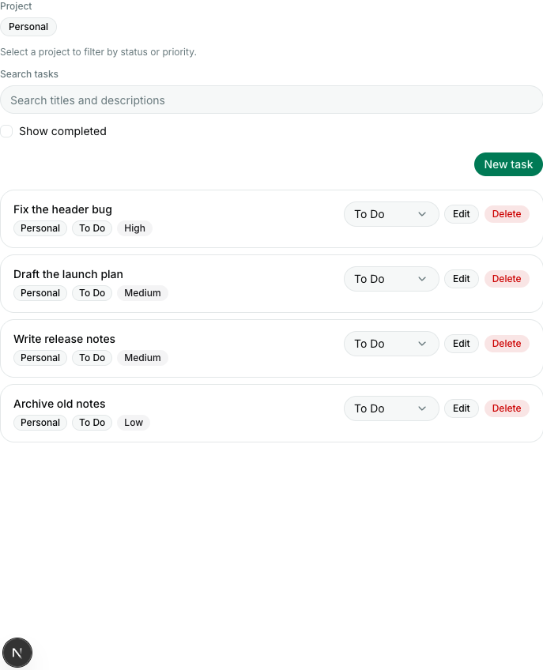

### B2.3 / B2.4 — completed tasks hidden by default, then last and marked

"Archive old notes" was moved to **Done** (a completed status). With *Show
completed* unchecked it is gone from the list:

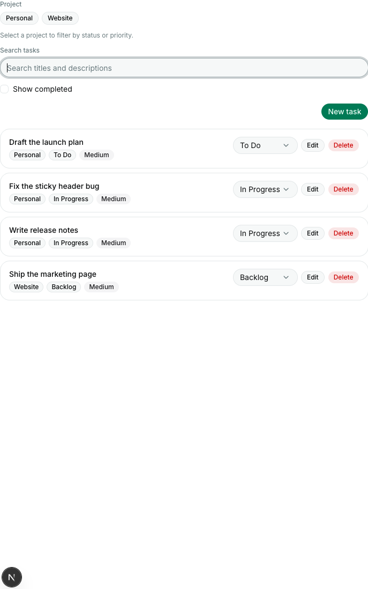

Checking the toggle brings it back — last, below all four open tasks, with a
struck-through title and a muted row. The row also carries `data-completed="true"`
where every other row carries `"false"`.


### B2.5 — opening a task shows every field

Title, the full multi-line description (not truncated), project, status and
priority:

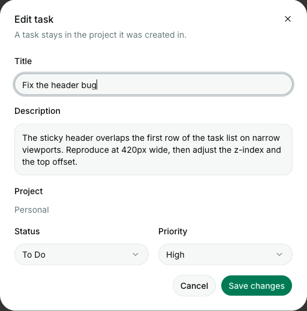

---

## US-B3 — Filter and search tasks

| # | Criterion (verbatim) | Result | Evidence |
| --- | --- | --- | --- |
| B3.1 | I can filter the list by project, by status, and by priority, individually or in combination. | **pass** | [us-b3-1-filter-project.png](./us-b3-1-filter-project.png), [us-b3-1-2-filters-combined.png](./us-b3-1-2-filters-combined.png) |
| B3.2 | Selecting/deselecting a tag updates the list immediately. | **pass** | [us-b3-1-2-filters-combined.png](./us-b3-1-2-filters-combined.png), [us-b3-2-deselect-restores-list.png](./us-b3-2-deselect-restores-list.png) |
| B3.3 | A text search input narrows the list to tasks whose title or description matches the query. | **pass** | [us-b3-3-search-matches-description.png](./us-b3-3-search-matches-description.png), [us-b3-4-search-within-filters.png](./us-b3-4-search-within-filters.png) |
| B3.4 | Search and tag filters combine (search applies within the filtered set). | **pass** | [us-b3-4-search-within-filters.png](./us-b3-4-search-within-filters.png) |
| B3.5 | An empty result state is shown when nothing matches, with a way to clear filters/search. | **pass** | [us-b3-5-empty-result-clear.png](./us-b3-5-empty-result-clear.png) |

### B3.1 — project alone

Selecting **Website** narrows five tasks to the one that belongs to it, and
reveals that project's status and priority chips underneath (Backlog, Blocked,
In Progress, Done — the project's own order):

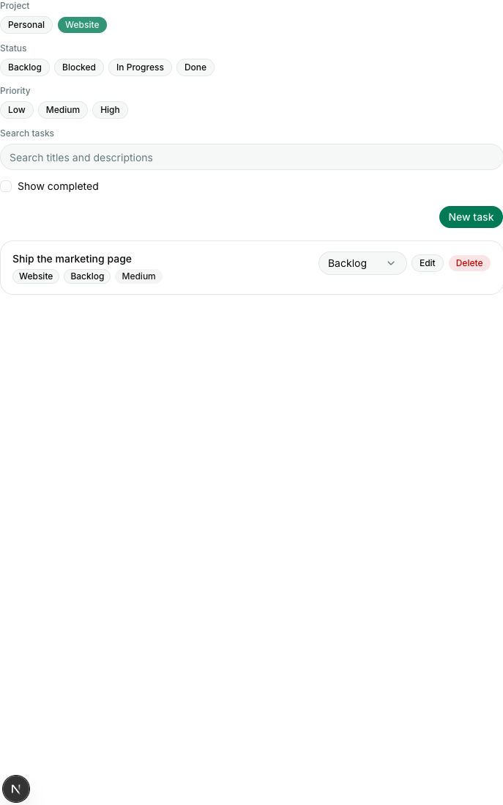

### B3.1 / B3.2 — project + status + priority, AND-combined

Personal → **To Do** → **Medium**, applied one chip at a time. Row counts read
out of the DOM after each click: 5 → 4 → 3 → 2.

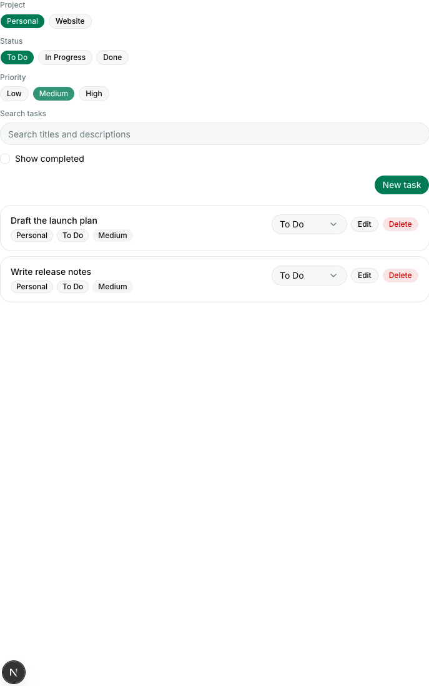

Deselecting is the same click again, and the list restores immediately (the
status/priority chip rows disappear with the project, back to the "Select a
project…" hint):

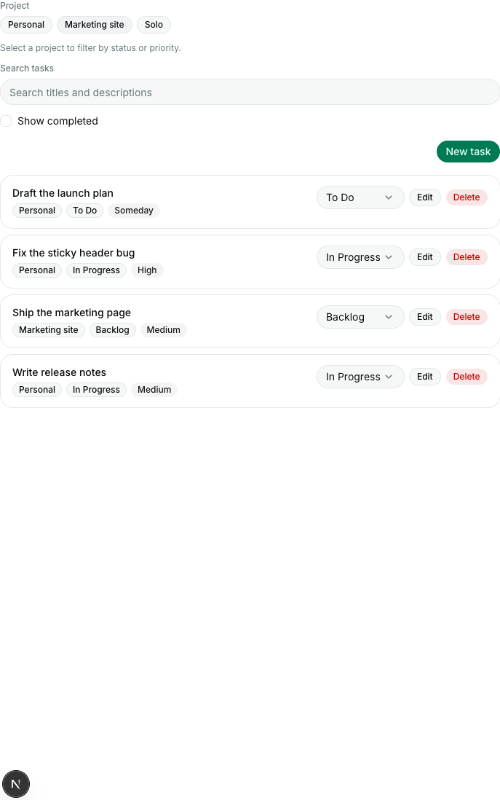

### B3.3 — search matches the description, not just the title

`z-index` appears only in "Fix the sticky header bug"'s **description**, and
that is the row that survives:

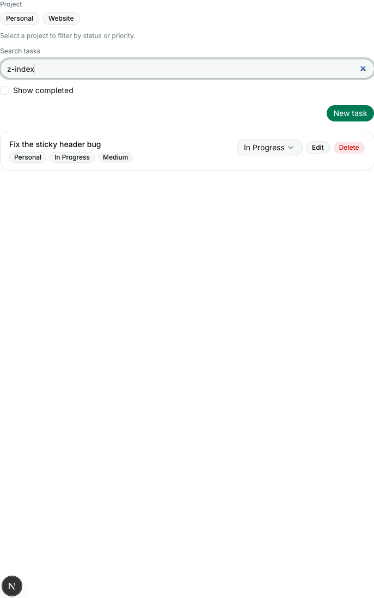

Title matching is shown by the B3.4 capture below (`release` →
"Write **release** notes").

### B3.4 — search applies within the filtered set

Filters Personal + To Do + Medium were left active (2 rows) and `release` typed
into the search box → 1 row. The filters remain visibly selected.

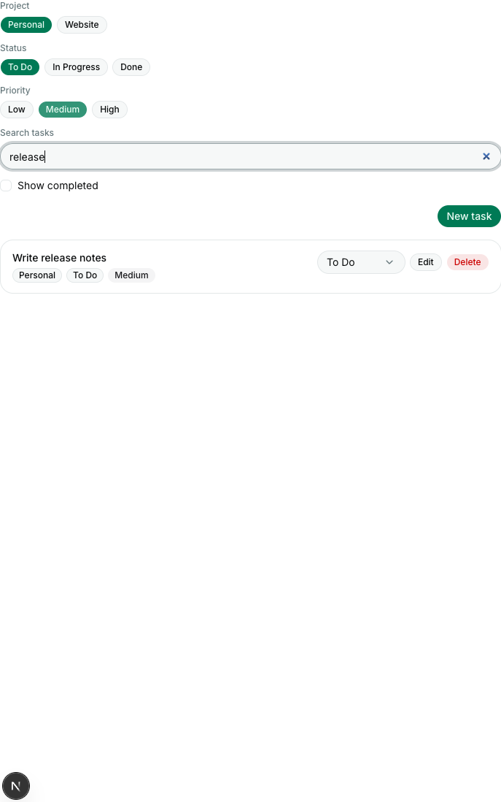

### B3.5 — empty state with a way out

With those filters still active, `z-index` matches nothing (the one task it
matches is In Progress, so the status chip excludes it). A dedicated
`task-list-empty` state appears with a **Clear filters** button; clicking it
reset every chip and the search box in one action and restored all 5 rows.

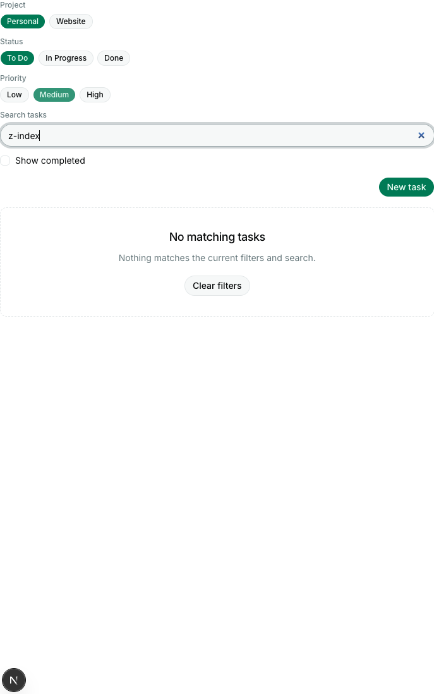

---

## US-B4 — Edit a task

| # | Criterion (verbatim) | Result | Evidence |
| --- | --- | --- | --- |
| B4.1 | I can edit a task's title, description, status, and priority. | **pass** | [us-b4-1-3-5-edit-reflected.png](./us-b4-1-3-5-edit-reflected.png), [us-b4-1-edit-persisted-fields.png](./us-b4-1-edit-persisted-fields.png) |
| B4.2 | The title cannot be cleared to empty. | **pass** | [us-b4-2-title-cannot-be-cleared.png](./us-b4-2-title-cannot-be-cleared.png) |
| B4.3 | Status and priority choices are limited to the task's own project's lists. | **pass** | [us-b4-3-4-edit-scoped-and-project-readonly.png](./us-b4-3-4-edit-scoped-and-project-readonly.png), [transcript-scoped-lists.txt](./transcript-scoped-lists.txt) |
| B4.4 | The task's project is displayed but **not editable** — there is no way in the UI to move a task to another project. | **pass** | [us-b4-3-4-edit-scoped-and-project-readonly.png](./us-b4-3-4-edit-scoped-and-project-readonly.png), [transcript-api-guards.txt](./transcript-api-guards.txt) |
| B4.5 | Saved changes are reflected in the list immediately. | **pass** | [us-b4-1-3-5-edit-reflected.png](./us-b4-1-3-5-edit-reflected.png) |

### B4.1 / B4.5 — all four editable fields, in one save

"Fix the header bug" → title, description, status (To Do → In Progress) and
priority (High → Medium) all changed in a single submit. The list updates
without a reload, including the row's position (it drops below the remaining
Mediums that were created earlier):

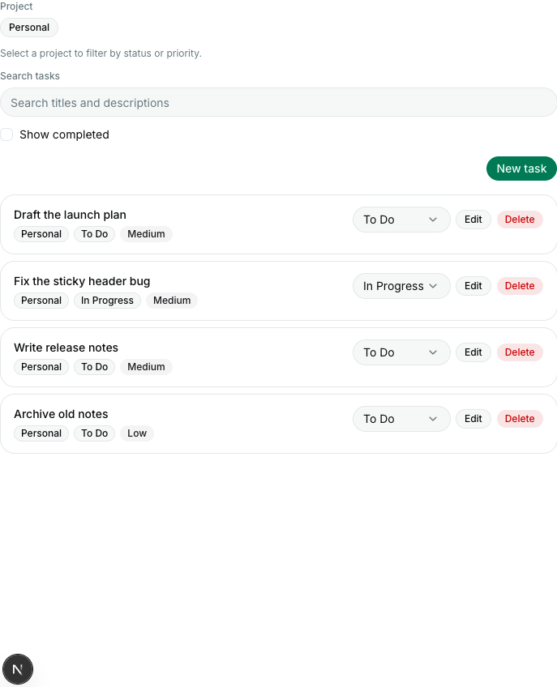

Reopening the task shows all four changes persisted:

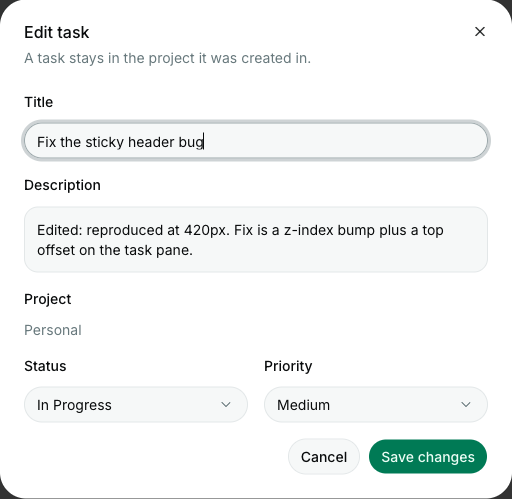

### B4.2 — the title cannot be cleared

Clearing the field and saving is refused inline; the dialog stays open and the
task keeps its old title (verified against `GET /api/tasks` afterwards).

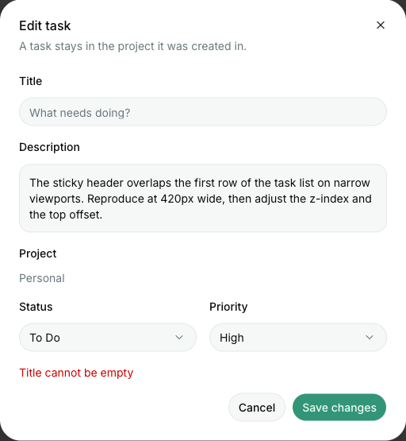

### B4.3 / B4.4 — scoped selects, and a read-only project

The edit dialog for a Marketing site task offers only Marketing site's lists,
and Project is rendered as static text with no control behind it — there is no
`task-form-project` element in the edit dialog at all:

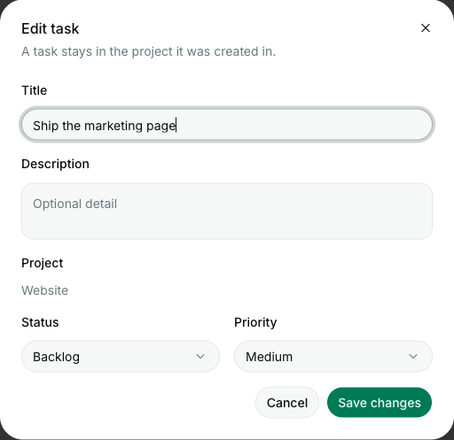

The immutability rule holds below the UI as well — `PATCH /api/tasks/<id>` does
not merely ignore a `projectId`, it rejects the request outright:

```
$ curl -X PATCH /api/tasks/<Draft the launch plan> -d '{"projectId":"<Marketing site>"}'
{"error":"Invalid request.","issues":[{"code":"unrecognized_keys","keys":["projectId"],
 "path":[],"message":"Unrecognized key: \"projectId\""}]}
HTTP 400
```

…and a follow-up `GET` shows the task still in `Personal`.

---

## US-B5 — Move a task's status

| # | Criterion (verbatim) | Result | Evidence |
| --- | --- | --- | --- |
| B5.1 | From the task list, I can change a task's status without opening a full edit form. | **pass** | [us-b5-1-2-4-quick-status-move.png](./us-b5-1-2-4-quick-status-move.png) |
| B5.2 | The available statuses are presented in the project's defined order. | **pass** | [us-b5-1-2-4-quick-status-move.png](./us-b5-1-2-4-quick-status-move.png), [transcript-scoped-lists.txt](./transcript-scoped-lists.txt) |
| B5.3 | Moving a task into a completed status makes it subject to the completed-task display rules (US-B2). | **pass** | [us-b2-3-b5-3-completed-hidden.png](./us-b2-3-b5-3-completed-hidden.png), [us-b2-3-4-completed-shown-last.png](./us-b2-3-4-completed-shown-last.png) |
| B5.4 | The change persists and is visible immediately. | **pass** | [us-b5-1-2-4-quick-status-move.png](./us-b5-1-2-4-quick-status-move.png) |

### B5.1 / B5.2 / B5.4 — one control, in the row

Every row carries its own status control. "Write release notes" was moved
To Do → In Progress from the list, with no dialog; the chip and the control both
update at once.

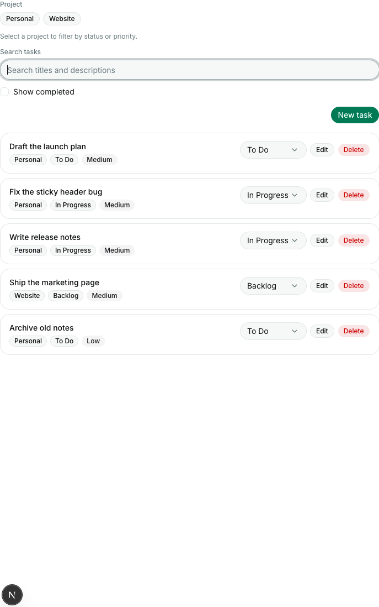

The options in each row are that row's project's statuses, in the project's
order — the Marketing site row lists **Backlog, Blocked, In Progress, Done**,
which is neither alphabetical nor creation order (Blocked was created last and
moved up twice in US-D1.2):

```
"Draft the launch plan"      (Personal)       ["To Do","In Progress","Done"]
"Ship the marketing page"    (Marketing site) ["Backlog","Blocked","In Progress","Done"]
```

### B5.3 — a quick move into a completed status obeys the completed rules

"Archive old notes" was moved to **Done** with the same row control, and
immediately became subject to US-B2.3/B2.4 — hidden, then last-and-struck-through
when revealed. Both captures are under [US-B2.3/B2.4](#b23--b24--completed-tasks-hidden-by-default-then-last-and-marked).

---

## US-B6 — Delete a task

| # | Criterion (verbatim) | Result | Evidence |
| --- | --- | --- | --- |
| B6.1 | Deleting a task requires an explicit confirmation step. | **pass** | [us-b6-1-delete-confirmation.png](./us-b6-1-delete-confirmation.png) |
| B6.2 | Declining the confirmation leaves the task unchanged. | **pass** | [us-b6-2-decline-leaves-task.png](./us-b6-2-decline-leaves-task.png) |
| B6.3 | Confirming removes the task from the list immediately and permanently. | **pass** | [us-b6-3-confirm-removes-task.png](./us-b6-3-confirm-removes-task.png) |

### B6.1 — Delete opens a confirmation, it does not delete

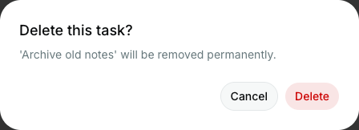

### B6.2 — declining changes nothing

Cancel closes the dialog with all five rows intact, and
`GET /api/tasks/<id>` still returns the task:


### B6.3 — confirming removes it, immediately and permanently

The row is gone from the list without a reload, and the record is gone from the
database — the same `GET` now answers `HTTP 404`:

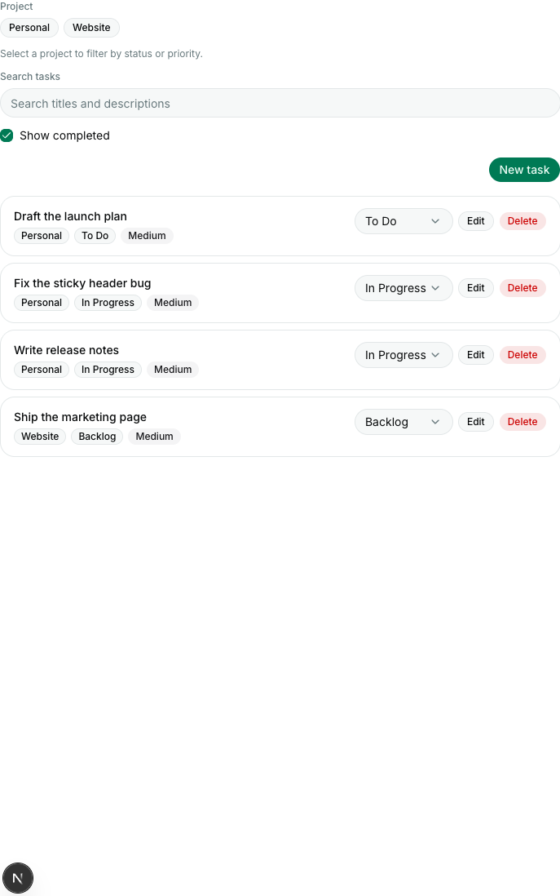

---

# Epic C — Project Management

## US-C1 — Create a project

| # | Criterion (verbatim) | Result | Evidence |
| --- | --- | --- | --- |
| C1.1 | I can create a project by providing a name. | **pass** | [us-c1-1-2-new-project-seeded.png](./us-c1-1-2-new-project-seeded.png) |
| C1.2 | The new project is seeded with the default statuses (To Do / In Progress / Done, *Done* = completed) and priorities (Low / Medium / High, *Medium* = default). | **pass** | [us-c1-1-2-new-project-seeded.png](./us-c1-1-2-new-project-seeded.png) |
| C1.3 | A task can be created in the new project immediately. | **pass** | [us-c1-3-task-in-new-project.png](./us-c1-3-task-in-new-project.png) |

### C1.1 / C1.2 — a name is all it takes, and the project arrives usable

"Website" created from the name field alone. Selecting it in *Managing lists for*
shows the full default set already in place: To Do / In Progress / **Done
(Completed ✓)** and Low / **Medium (Default)** / High, in that order.

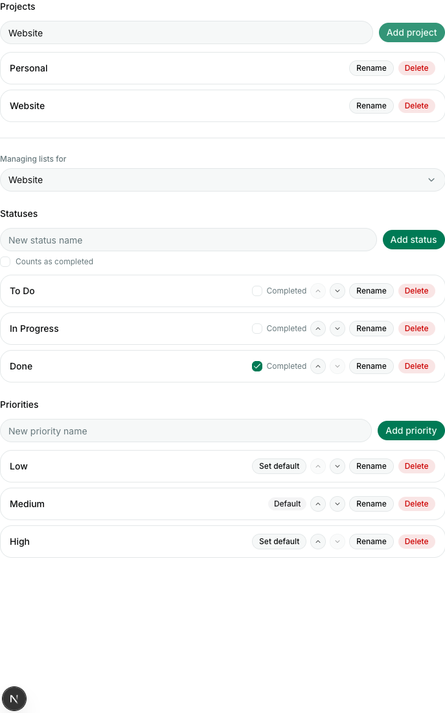

### C1.3 — immediately usable

With no further setup, "Ship the marketing page" was created in the new project
and picked up its defaults (To Do, Medium):

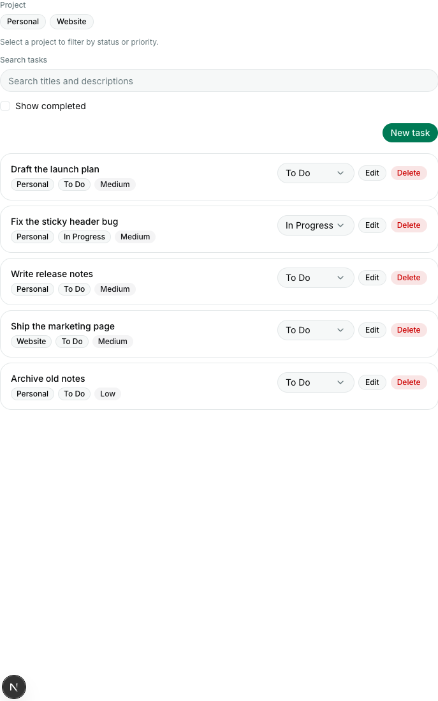

---

## US-C2 — Rename a project

| # | Criterion (verbatim) | Result | Evidence |
| --- | --- | --- | --- |
| C2.1 | Renaming a project updates its name everywhere it appears (task tags, filters, management screens). | **pass** | [us-c2-1-2-project-renamed-lists-intact.png](./us-c2-1-2-project-renamed-lists-intact.png), [us-c2-1-rename-on-chips-and-filters.png](./us-c2-1-rename-on-chips-and-filters.png) |
| C2.2 | The project's tasks, statuses, and priorities are unaffected. | **pass** | [us-c2-1-2-project-renamed-lists-intact.png](./us-c2-1-2-project-renamed-lists-intact.png), [us-c2-1-rename-on-chips-and-filters.png](./us-c2-1-rename-on-chips-and-filters.png) |

"Website" → "Marketing site". The management screen — both the project row and
the *Managing lists for* select — picks up the new name, and the project's
customised statuses (Backlog / Blocked / In Progress / Done) and priorities are
untouched:

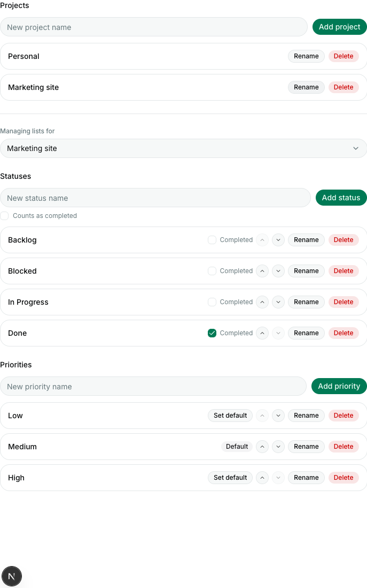

On the Tasks tab, both the project **filter chip** and the task's **project
chip** show the new name, and the task itself is otherwise unchanged (still
Backlog / Medium):

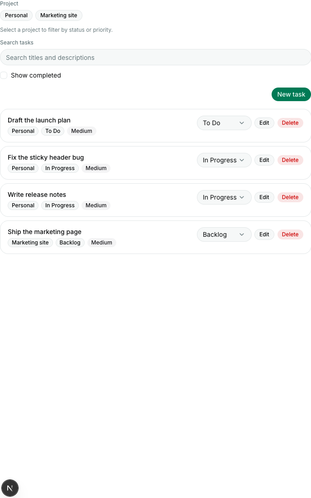

---

## US-C3 — Delete a project

| # | Criterion (verbatim) | Result | Evidence |
| --- | --- | --- | --- |
| C3.1 | Deleting a project with zero tasks succeeds (after confirmation) and removes it and its statuses/priorities. | **pass** | [us-c3-1-empty-project-deleted.png](./us-c3-1-empty-project-deleted.png) |
| C3.2 | Attempting to delete a project that has tasks (open **or** completed) is blocked. | **pass** | [us-c3-2-3-delete-project-blocked.png](./us-c3-2-3-delete-project-blocked.png), [us-c3-2-blocked-completed-task-only.png](./us-c3-2-blocked-completed-task-only.png) |
| C3.3 | The block message states the reason (e.g., how many tasks remain) and what I can do about it. | **pass** | [us-c3-2-3-delete-project-blocked.png](./us-c3-2-3-delete-project-blocked.png) |

### C3.2 / C3.3 — blocked, with the count and the remedy

**Open tasks.** Personal held 3 open tasks:

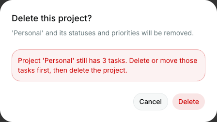

> Project 'Personal' still has 3 tasks. Delete or move those tasks first, then delete the project.

That is both halves of C3.3 in one line: the reason *with the count*, and the
remedy.

**Completed tasks.** The criterion calls out "open **or** completed"
specifically, so it was tested separately: a throwaway project *Scratch* was
created, given one task, and that task moved to **Done**. With nothing open left
in it, the delete is still blocked:

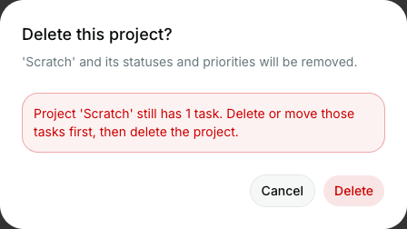

> Project 'Scratch' still has 1 task. Delete or move those tasks first, then delete the project.

### C3.1 — an empty project deletes, and takes its lists with it

The Scratch task was then deleted, making the project empty, and the delete went
through after confirmation. Scratch is gone from the project list and from the
*Managing lists for* select:

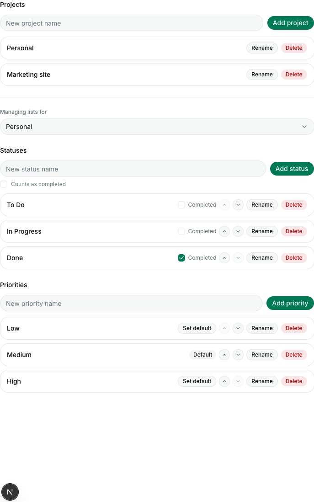

"and removes it **and its statuses/priorities**" was checked in the database
rather than inferred, since orphaned rows would not be visible in the UI:

```
statuses rows left: 0 | priorities rows left: 0   -- where project_id = <Scratch>
```

(Scratch had 3 statuses and 3 priorities immediately before the delete.)

---

# Epic D — Status Management (per project)

## US-D1 — Manage statuses

| # | Criterion (verbatim) | Result | Evidence |
| --- | --- | --- | --- |
| D1.1 | Status management is always in the context of a selected project; each project's statuses are independent. | **pass** | [us-d1-1-e1-1-lists-personal.png](./us-d1-1-e1-1-lists-personal.png), [us-d1-1-e1-1-lists-marketing-site.png](./us-d1-1-e1-1-lists-marketing-site.png) |
| D1.2 | I can create a status, rename a status, and reorder statuses; the defined order is respected everywhere statuses appear. | **pass** | [us-d1-2-status-create-rename-reorder.png](./us-d1-2-status-create-rename-reorder.png), [us-b3-1-filter-project.png](./us-b3-1-filter-project.png), [transcript-scoped-lists.txt](./transcript-scoped-lists.txt) |
| D1.3 | I can toggle a status's **completed** flag; tasks in that status immediately follow the completed display rules. | **pass** | [us-d1-3-toggle-completed-flag.png](./us-d1-3-toggle-completed-flag.png), [us-d1-3-tasks-now-hidden.png](./us-d1-3-tasks-now-hidden.png), [us-d1-3-tasks-now-completed-styled.png](./us-d1-3-tasks-now-completed-styled.png) |
| D1.4 | Changes are reflected on existing tasks' tags immediately (e.g., a rename shows on every task in that status). | **pass** | [us-d1-4-status-rename-on-chips.png](./us-d1-4-status-rename-on-chips.png) |

### D1.1 — always project-scoped, and independent

There is no way to reach the status list except through *Managing lists for*.
The two projects' lists diverged entirely and stayed that way:

| Personal | Marketing site |
| --- | --- |
| 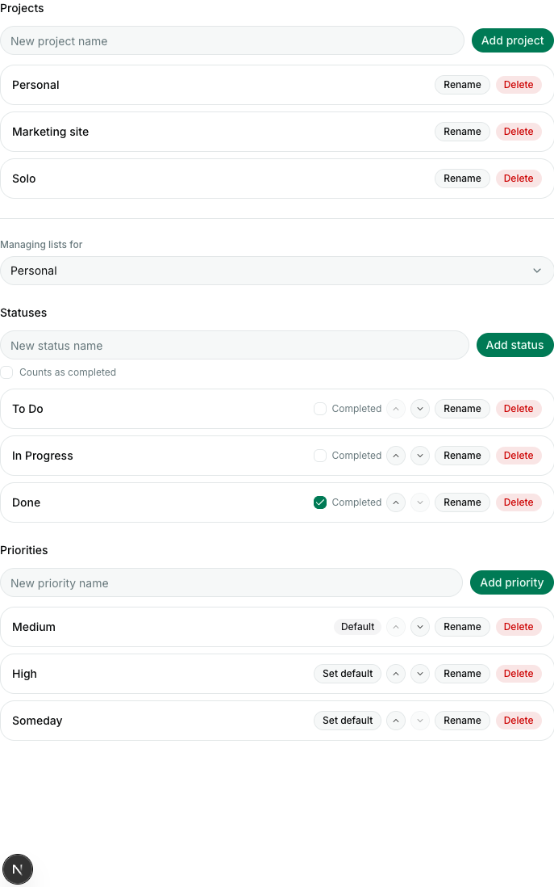 | 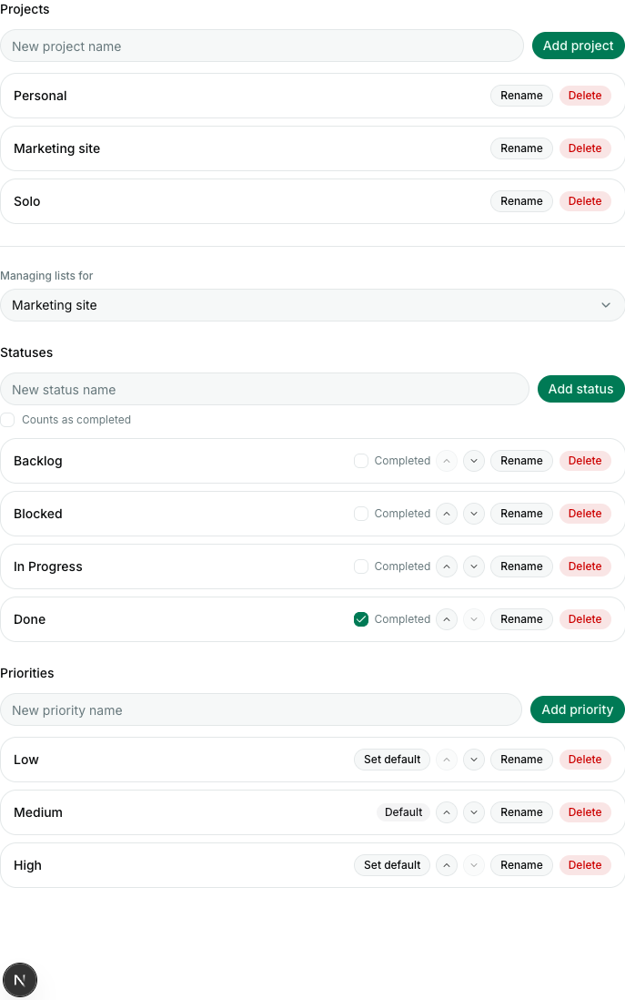 |

Personal keeps To Do / In Progress / Done throughout every edit made to
Marketing site's statuses, and vice versa.

### D1.2 — create, rename, reorder — and the order is honoured everywhere

On Marketing site: **To Do** renamed to **Backlog**, a new **Blocked** created
(it lands last), then moved up twice.


The resulting order — Backlog, Blocked, In Progress, Done — then shows up
unchanged in all three other places statuses appear:

* the **status filter chips** when that project is selected —
  
* each **task row's status control** (`transcript-scoped-lists.txt`)
* the **create/edit dialog's** Status select (`transcript-scoped-lists.txt`)

### D1.3 — the completed flag, and its effect on tasks

Personal's **In Progress** was toggled to Completed:

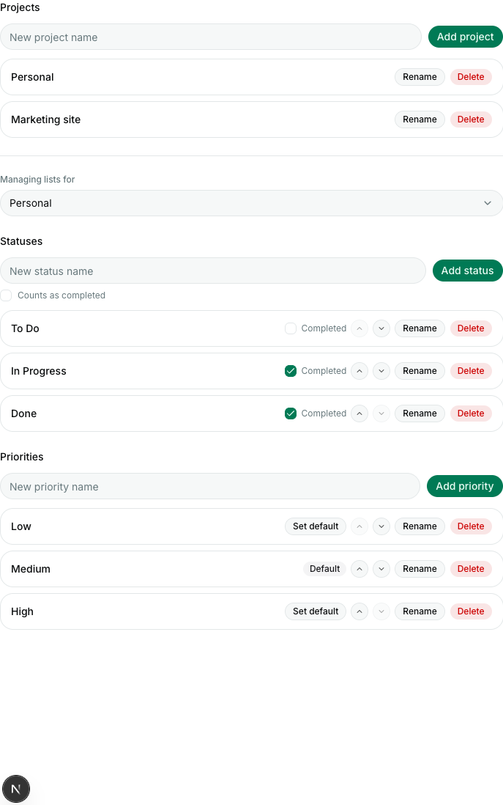

Its two tasks immediately vanish from the default view…

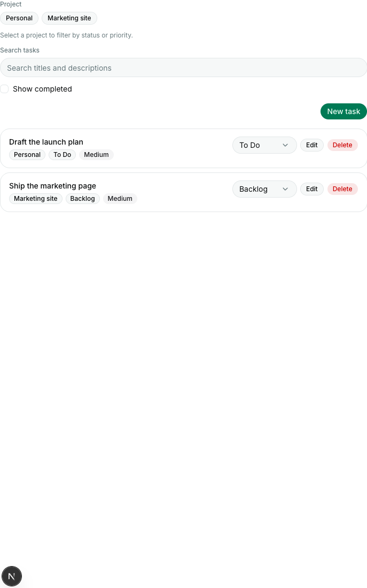

…and reappear last, struck through, under *Show completed* — the full US-B2.3/2.4
treatment, with no task having been touched:

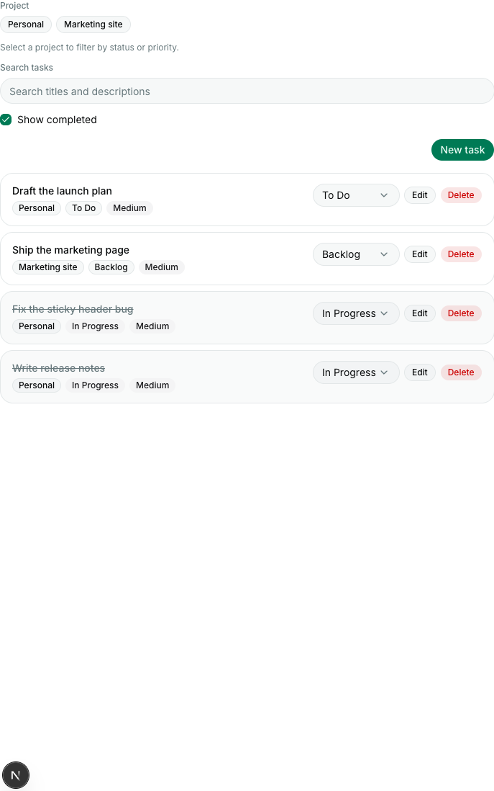

(The flag was toggled back off afterwards.)

### D1.4 — a rename lands on existing task chips

Marketing site's To Do → Backlog rename, seen from the Tasks tab with no page
reload. "Ship the marketing page" now reads **Backlog** while every Personal
task still reads **To Do** — the rename followed the status, not the label text:


---

## US-D2 — Delete a status

| # | Criterion (verbatim) | Result | Evidence |
| --- | --- | --- | --- |
| D2.1 | Deleting a status used by zero tasks succeeds. | **pass** | [us-d2-1-delete-unused-status-confirm.png](./us-d2-1-delete-unused-status-confirm.png), [us-d2-1-unused-status-deleted.png](./us-d2-1-unused-status-deleted.png) |
| D2.2 | Deleting a status that any task currently uses is blocked, with a message stating the reason and remedy (reassign or delete those tasks first). | **pass** | [us-d2-2-in-use-status-blocked.png](./us-d2-2-in-use-status-blocked.png) |
| D2.3 | Deleting the project's **last remaining status** is blocked, even if unused. | **pass** | [us-d2-3-last-status-blocked.png](./us-d2-3-last-status-blocked.png) |

### D2.1 — an unused status deletes

A **Review** status was created in Personal and left unused, then deleted after
confirming:

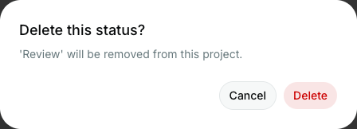
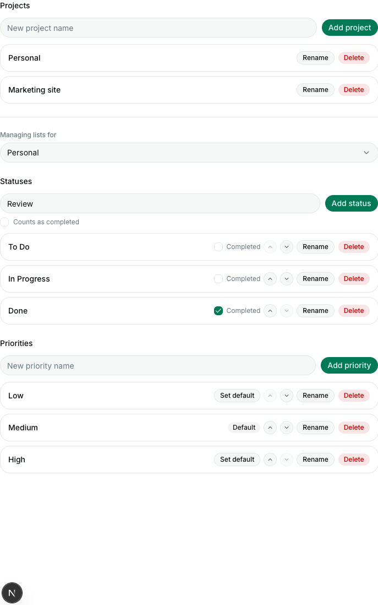

### D2.2 — an in-use status is blocked, with the reason and the remedy

Personal's **To Do** is used by "Draft the launch plan":

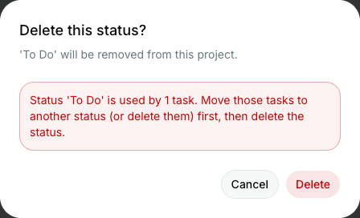

> Status 'To Do' is used by 1 task. Move those tasks to another status (or delete them) first, then delete the status.

### D2.3 — the last remaining status is blocked even when unused

A fresh project *Solo* was created and its two unused extra statuses deleted
(proving D2.1 a second time), leaving exactly one, still used by nobody:

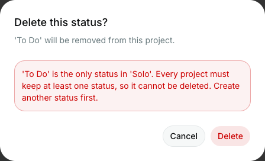

> 'To Do' is the only status in 'Solo'. Every project must keep at least one status, so it cannot be deleted. Create another status first.

---

# Epic E — Priority Management (per project)

## US-E1 — Manage priorities

| # | Criterion (verbatim) | Result | Evidence |
| --- | --- | --- | --- |
| E1.1 | Priority management is always in the context of a selected project; each project's priorities are independent. | **pass** | [us-d1-1-e1-1-lists-personal.png](./us-d1-1-e1-1-lists-personal.png), [us-d1-1-e1-1-lists-marketing-site.png](./us-d1-1-e1-1-lists-marketing-site.png) |
| E1.2 | I can create a priority, rename a priority, and reorder priorities; order is respected everywhere (including task list sorting). | **pass** | [us-e1-2-priority-create-rename-reorder.png](./us-e1-2-priority-create-rename-reorder.png), [us-e1-2-sort-before-reorder.png](./us-e1-2-sort-before-reorder.png), [us-e1-2-4-sort-after-reorder-and-rename.png](./us-e1-2-4-sort-after-reorder-and-rename.png) |
| E1.3 | I can designate a priority as the project's **default**; exactly one default exists at all times. | **pass** | [us-e1-3-set-default.png](./us-e1-3-set-default.png), [us-e1-3-new-task-takes-default.png](./us-e1-3-new-task-takes-default.png) |
| E1.4 | Renames are reflected on existing tasks' tags immediately. | **pass** | [us-e1-2-4-sort-after-reorder-and-rename.png](./us-e1-2-4-sort-after-reorder-and-rename.png) |

### E1.1 — project-scoped and independent

Same control, same guarantee as D1.1. At the end of the run Personal holds
Medium / High / Someday while Marketing site still holds the untouched Low /
Medium / High and Solo holds a single Low — see the two screenshots under
[D1.1](#d11--always-project-scoped-and-independent).

### E1.2 — create, rename, reorder; the task list re-sorts

Starting point — Personal's tasks spread across Low / Medium / High, sorted
highest-first:

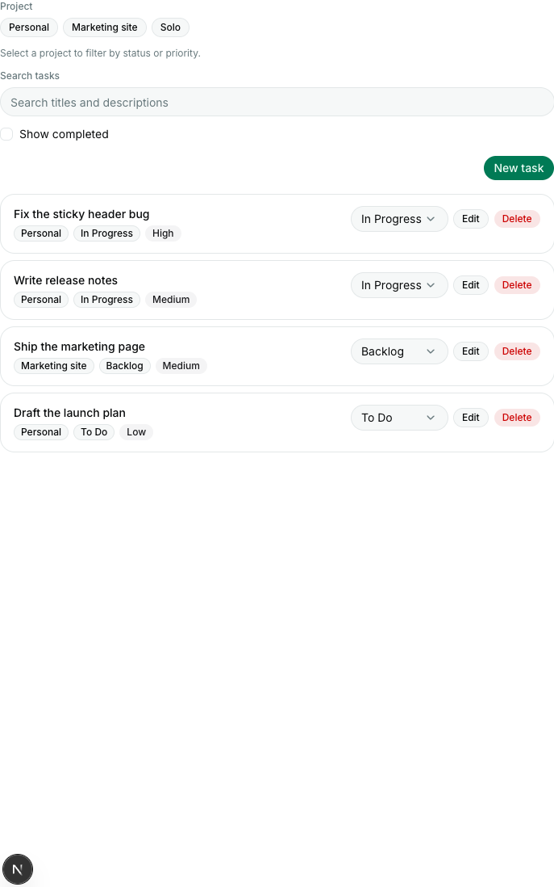

Then, on Personal: **Critical** created, **Low** renamed to **Someday**, and
Someday moved *down* twice (down = higher priority in this list, which is
rendered lowest-first):

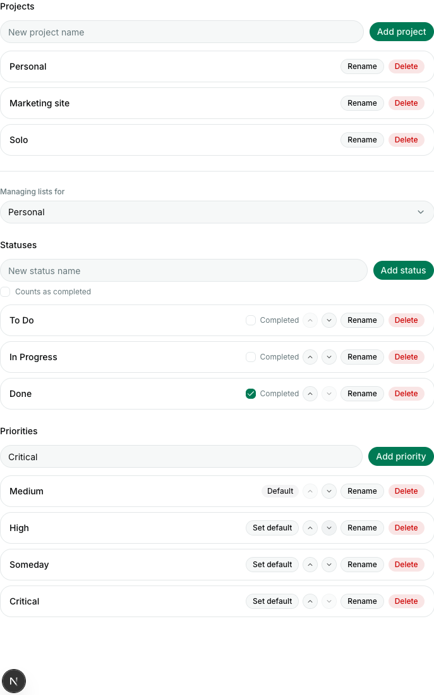

The task list re-sorts on its own. "Draft the launch plan" — untouched, still on
the same priority record — moves from last to first purely because that
priority's order changed, and the chip now reads **Someday**:


This is the sharpest single check in the packet: it proves the ordering is
computed from `priorities.order` rather than baked into the task rows, which is
exactly the invariant the implementation's "every list mutation invalidates
`["tasks"]`" decision exists to protect.

### E1.3 — exactly one default, and a new task takes it

**Critical** designated default. The `Default` badge moves off Medium and onto
Critical, and a DOM count confirms exactly one `priority-default-badge-*` node
exists — every other row shows a *Set default* button:


"Exactly one at all times" is a claim about every intermediate state, so it was
also checked at the two moments most likely to break it — and it held at both:

* after **deleting** the default priority, the badge had already moved to the
  next one (see [E2.4](#e21--e24--deleting-an-unused-priority-and-what-happens-to-the-default))
* on a **brand-new** project, exactly one arrives seeded (see [C1.2](#c11--c12--a-name-is-all-it-takes-and-the-project-arrives-usable))

A task created with priority left blank picks up the new default, confirming the
designation is real and not cosmetic:

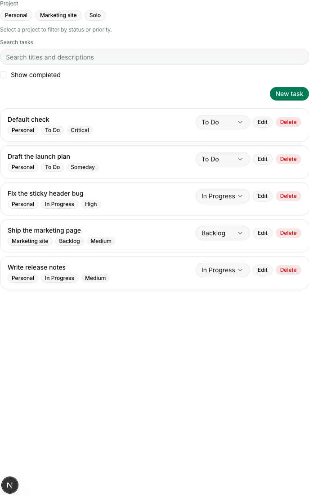

### E1.4 — a rename lands on existing task chips

Low → Someday is visible on "Draft the launch plan" in the capture above, with
no reload and no edit to the task.

---

## US-E2 — Delete a priority

| # | Criterion (verbatim) | Result | Evidence |
| --- | --- | --- | --- |
| E2.1 | Deleting a priority used by zero tasks succeeds. | **pass** | [us-e2-1-4-default-deleted-reassigned.png](./us-e2-1-4-default-deleted-reassigned.png) |
| E2.2 | Deleting a priority that any task currently uses is blocked, with a message stating the reason and remedy. | **pass** | [us-e2-2-in-use-priority-blocked.png](./us-e2-2-in-use-priority-blocked.png) |
| E2.3 | Deleting the project's **last remaining priority** is blocked, even if unused. | **pass** | [us-e2-3-last-priority-blocked.png](./us-e2-3-last-priority-blocked.png) |
| E2.4 | If the deleted priority was the default, the default designation automatically moves to the project's first priority by order. | **pass** | [us-e2-1-4-default-deleted-reassigned.png](./us-e2-1-4-default-deleted-reassigned.png) |

### E2.1 / E2.4 — deleting an unused priority, and what happens to the default

**Critical** — unused (the one task that had it was deleted first) and the
current default — was deleted. It goes, and the `Default` badge lands on
**Medium**, which is Personal's first priority by order:


The same behaviour was observed a second time in *Solo*, where deleting the
default (Medium) moved the designation to Low, again the first by order.

### E2.2 — an in-use priority is blocked, with the reason and the remedy

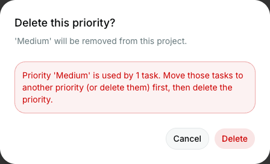

> Priority 'Medium' is used by 1 task. Move those tasks to another priority (or delete them) first, then delete the priority.

### E2.3 — the last remaining priority is blocked even when unused

*Solo* stripped down to one priority, used by no task:

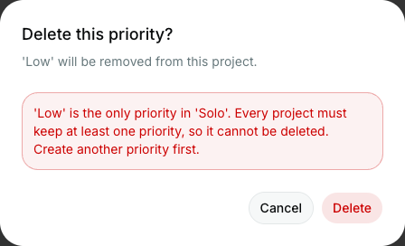

> 'Low' is the only priority in 'Solo'. Every project must keep at least one priority, so it cannot be deleted. Create another priority first.

---

## Observations (not acceptance criteria)

Two behaviours were noticed while working through the packet. Neither is
required or prohibited by any criterion in scope, so neither changes a result —
but both are real, reproducible, and better written down than left for someone
to rediscover.

1. **Create fields keep their text after a successful submit.**
   `components/shared/inline-name-form.tsx` holds the input in local state and
   never resets it on success, so after adding the project "Website" the field
   still reads `Website` (visible in
   [us-c1-1-2-new-project-seeded.png](./us-c1-1-2-new-project-seeded.png)), and
   likewise after adding a status
   ([us-d1-2-status-create-rename-reorder.png](./us-d1-2-status-create-rename-reorder.png))
   or a priority
   ([us-e1-2-priority-create-rename-reorder.png](./us-e1-2-priority-create-rename-reorder.png)).
   A second click on the submit button would create a duplicate. This affects
   all three create forms, since they share the component.

2. **Filter, search and show-completed state resets when the tab is switched.**
   Measured directly:

   ```
   BEFORE tab switch: {search:"release", showCompleted:"true", projectChipsSelected:1}
   AFTER  tab switch: {search:"",        showCompleted:"false", statusChips:0}
   ```

   Going to *Manage lists* and back clears the whole filter bar. The same is
   true of the *Managing lists for* selection, which returns to the first
   project. No criterion asks for this state to survive, and the behaviour is
   consistent rather than glitchy — flagging it as a product decision worth
   making deliberately rather than a defect.

---

## Supporting evidence

Captured by this verification pass:

| File | What it is |
| --- | --- |
| [`transcript-e2e-run.txt`](./transcript-e2e-run.txt) | Independent re-run of `pnpm test:e2e` — `next build`, then the whole suite against `next start` and the separate test database. **47/47 pass, exit 0** |
| [`transcript-api-guards.txt`](./transcript-api-guards.txt) | Live HTTP responses for the rules the UI makes unreachable (US-B1.2, US-B1.5, US-B4.4) |
| [`transcript-scoped-lists.txt`](./transcript-scoped-lists.txt) | `<select>` option lists per project (US-B1.5, US-B4.3/4.4, US-B5.2, US-D1.2) |
| [`transcript-console-and-errors.txt`](./transcript-console-and-errors.txt) | Plan §3.1 hygiene — `errors` empty, console clean |
| [`shot-00-initial-empty.png`](./shot-00-initial-empty.png) | The freshly seeded workspace this run started from |
| [`shot-01-manage-lists.png`](./shot-01-manage-lists.png) | The Manage lists surface before any edits |
| [`shot-99-final-split-screen.png`](./shot-99-final-split-screen.png) | The whole §8.0 split screen at the end of the run |

Carried over from the implementation session (not re-produced here; provenance
noted so the packet does not imply first-hand capture):

| File | What it is |
| --- | --- |
| `01-a11y-tasks-tab.json`, `02-a11y-task-form.json`, `03-a11y-manage-lists.json`, `04-a11y-manage-lists-dark.json` | Plan §3.2 `a11y --tags wcag2a,wcag2aa` results |
| `05-react-renders.txt` | Plan §3.2 `react renders` — no runaway re-renders on filter/search |
| `06-network-api-calls.txt` | Network trace of the API calls the UI makes |
| `07-test-e2e.txt`, `08-typecheck.txt`, `09-lint.txt` | The implementation session's suite, typecheck and lint output |
