# Phase 5 verification packet — Chat UI rewire (Epic F frontend half)

**Scope:** US-F1 … US-F6, the twenty-six acceptance criteria of Epic F.
**Verdict: PASS** — 26 of 26 criteria pass. One defect was found outside the
criteria and is recorded below.

Every criterion in this packet was exercised by hand against a running
instance: a real browser driven by `agent-browser`, `pnpm dev` on port 3100,
the Neon **dev** database freshly `pnpm db:reset`, a live EVE agent and a live
model. Nothing was mocked, and no claim rests on reading source. Where a
criterion is about an *effect* — a task created with the right defaults, a
denied delete leaving the row alone, a bulk change actually applied — the
screenshot is paired with a direct `SELECT` against Postgres taken at the same
moment, because the assistant's prose is not evidence that anything happened.
The `06-agent-chat` E2E suite was then re-run from scratch against the
production topology (`eve build` + `next build` + `next start` + `eve start`)
on the separate Neon **test** database.

The one defect found: if the app process dies **while a turn is in flight**,
the conversation is left unresumable, and it fails silently — after the
restart the transcript restores, but the next message is accepted and never
answered, with the composer disabled forever and no error shown. A clean
restart between turns is unaffected. See
[Defect 1](#defect-1--a-turn-interrupted-by-process-death-leaves-the-conversation-unresumable-and-silent).

---

## How to read this packet

Screenshots are named `us-f<story>-<criterion>-<what>.png` and are linked under
the criterion they prove. Each is the state **after** the action, with the
relevant UI visible. The left half of every shot is the direct UI, which
doubles as an independent read of the same data the agent just touched.

| | |
| --- | --- |
| App under test | `pnpm dev`, `http://localhost:3100`, Neon dev database, reset + seeded at the start of the run |
| Browser | `agent-browser` 0.33.1, isolated session `phase-5-verify`, 1600×1000, light theme, pointed only at localhost |
| Agent | the project's own EVE agent, spawned by `withEve()` from `next dev`, real model through the Vercel AI Gateway |
| Data assertions | direct `postgres` reads of `projects` / `statuses` / `priorities` / `tasks` / `chat_state` |
| Test evidence | [`run-06-agent-chat.txt`](./run-06-agent-chat.txt) |

Everything the agent wrote into the chat pane was treated as untrusted data
(§3.4): it was read to make assertions, never acted on. No credential appeared
on any command line.

---

## Results at a glance

| Story | Criterion | Result |
| --- | --- | --- |
| US-F1 | 1.1 split screen, both halves always usable | **pass** |
| US-F1 | 1.2 real EVE agent over live data | **pass** |
| US-F1 | 1.3 one conversation; reload / restart preserves full history | **pass** |
| US-F1 | 1.4 prior context carries across sessions | **pass** |
| US-F2 | 2.1 questions answered from current data | **pass** |
| US-F2 | 2.2 answers reflect UI changes made moments earlier | **pass** |
| US-F2 | 2.3 finds tasks by text using search | **pass** |
| US-F2 | 2.4 says so when a thing does not exist | **pass** |
| US-F3 | 3.1 create takes the same defaults as the UI | **pass** |
| US-F3 | 3.2 edit title / description / status / priority; direct move | **pass** |
| US-F3 | 3.3 delete asks first; declining changes nothing | **pass** |
| US-F3 | 3.4 project move refused, rule explained, alternative offered | **pass** |
| US-F3 | 3.5 non-destructive single-task actions are not gated | **pass** |
| US-F4 | 4.1 create and rename projects; seeded defaults | **pass** |
| US-F4 | 4.2 statuses and priorities: create / rename / reorder / flags | **pass** |
| US-F4 | 4.3 deleting a project, status or priority asks first | **pass** |
| US-F4 | 4.4 blocked deletions refused, explained, path forward offered | **pass** |
| US-F5 | 5.1 multi-task change is treated as bulk | **pass** |
| US-F5 | 5.2 states which tasks, what change, how many, and waits | **pass** |
| US-F5 | 5.3 approve applies all; decline changes nothing | **pass** |
| US-F5 | 5.4 reports what was actually changed | **pass** |
| US-F6 | 6.1 each action is a distinct structured entry, separate from prose | **pass** |
| US-F6 | 6.2 the reply also summarises in plain language | **pass** |
| US-F6 | 6.3 one entry per action, in order | **pass** |
| US-F6 | 6.4 structured entries persist as conversation history | **pass** |

---

## US-F1: Converse with the agent

### 1.1 — "The app is a **split screen**: the direct UI (task view + list management) occupies the left half, the agent chat the right half — both visible and usable at all times, with no navigation between them."

**pass.** One page, no routes: the task pane on the left with its own tabs, the
agent on the right with the composer live. Both were used in the same session
without navigating — every later screenshot shows the left pane reflecting a
change the right pane made.

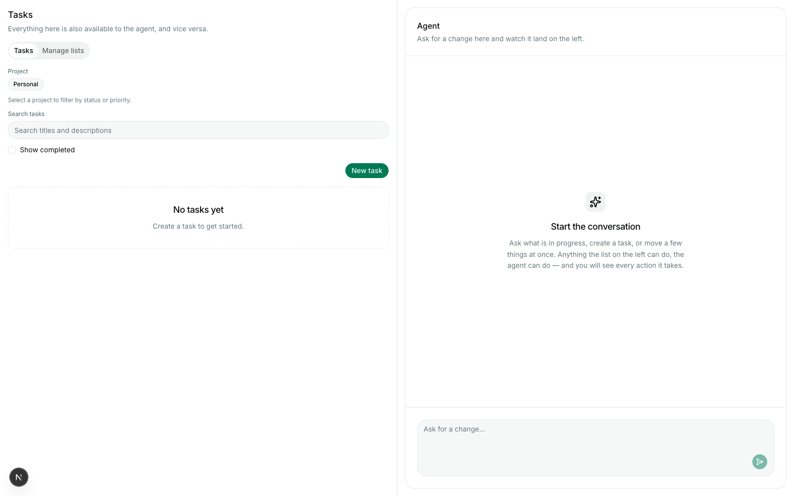

### 1.2 — "The chat is powered by a **real agent built on the Vercel EVE Agent Framework** — responses come from a live agent reasoning over live data, not mocks or canned replies."

**pass.** The strongest proof that this is not canned: the first turn read the
project list, created a row, and the row appeared in the left pane and in
Postgres with a database-generated id.

```
TASKS:
  [Personal] "Fix the header bug" status=To Do priority=Medium desc=null (d8aff14b-1f15-4891-a618-f80d1cac9cef)
CHAT_STATE:
  events=19 session={"sessionId":"wrun_01KYP0FYCN6736W6MJ5GY2BPWJ","streamIndex":19,
                     "continuationToken":"eve:2481dbbb-7759-4308-916e-a816b9d6c325"}
```

`sessionId` / `streamIndex` / `continuationToken` are EVE's own session cursor,
persisted in full — all three fields, which is what makes US-F1.4 work. The
first conversation of this run reached 38 turns and 642 events on that one
`wrun_01KYP0FYCN…` session.

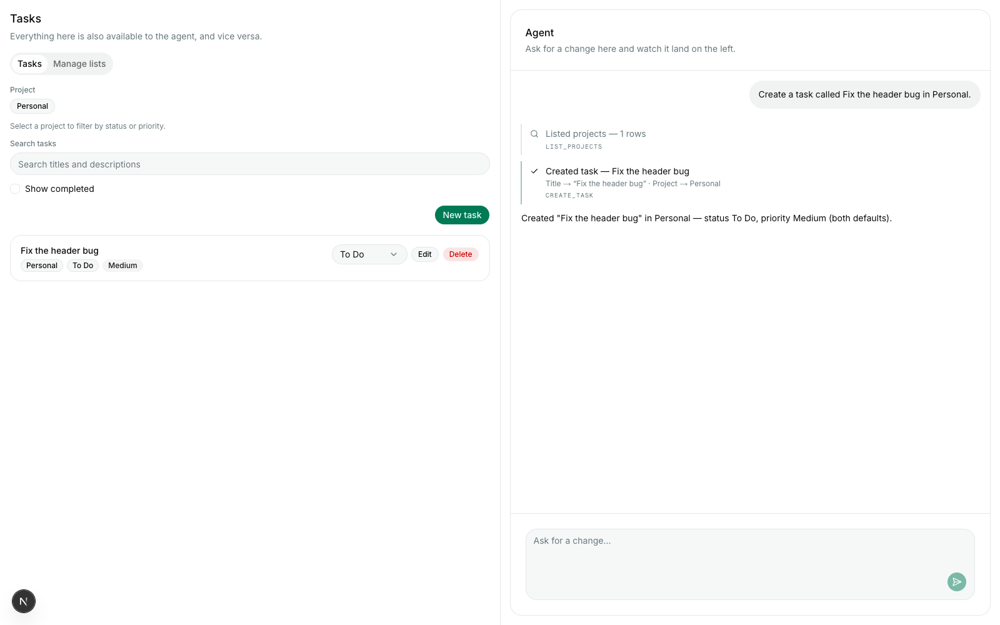

### 1.3 — "There is a single ongoing conversation; reloading the page or restarting the app preserves the full history."

**pass.** Two separate demonstrations.

*Reload.* A two-turn conversation, then `agent-browser reload`. The full
transcript comes back — user bubbles, structured entries, prose — and the pane
opens on the latest turn rather than somewhere in the middle.

Before the reload:


After the reload (same conversation, nothing lost):

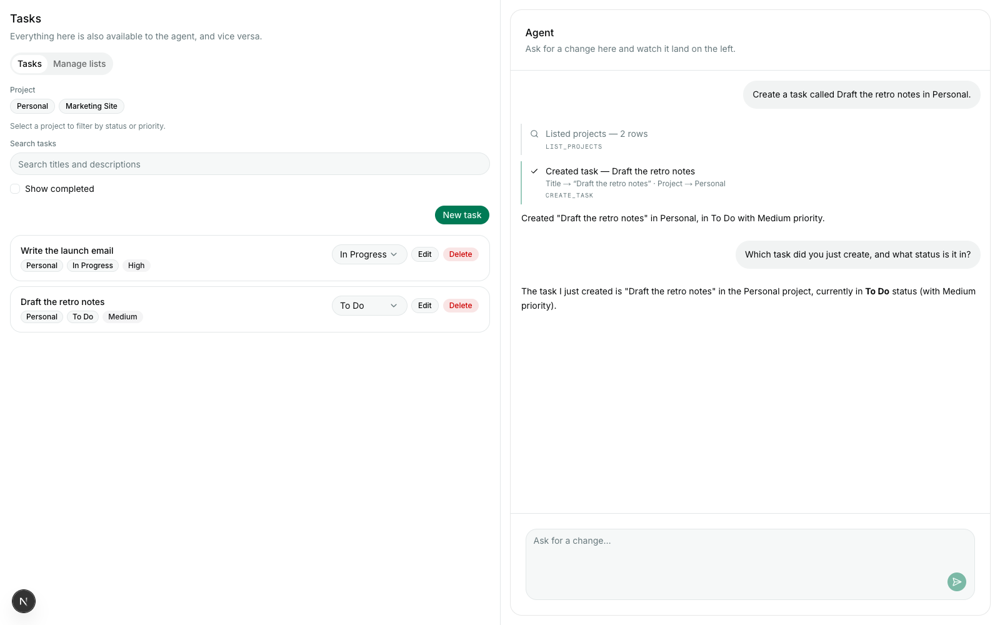

The same held for the long conversation earlier in the run: 35 `action-entry`
nodes before the reload and 35 after, including the *denied* bulk entry, with
the very first turn of the session still at the top of the scrollback.

| | |
| --- | --- |
| 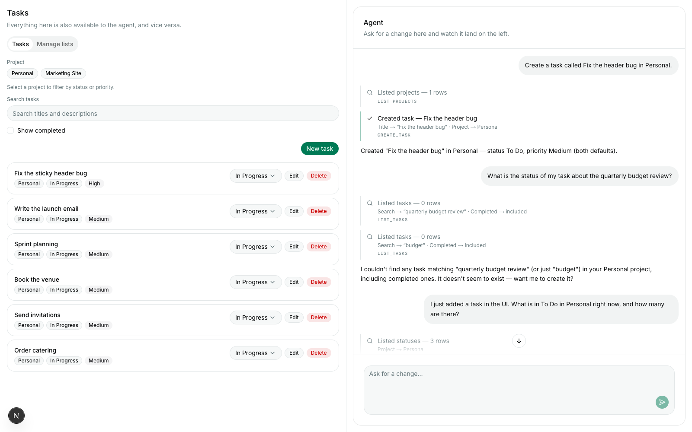 | 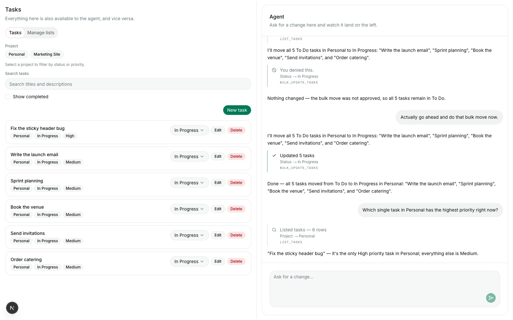 |
| the top of the restored transcript — the session's first turn | the bottom — where the restored pane actually opens |

*Restarting the app.* The `next dev` process was stopped between turns and
started again. The whole conversation came back, and — see US-F1.4 below — it
could be carried on as if nothing had happened:

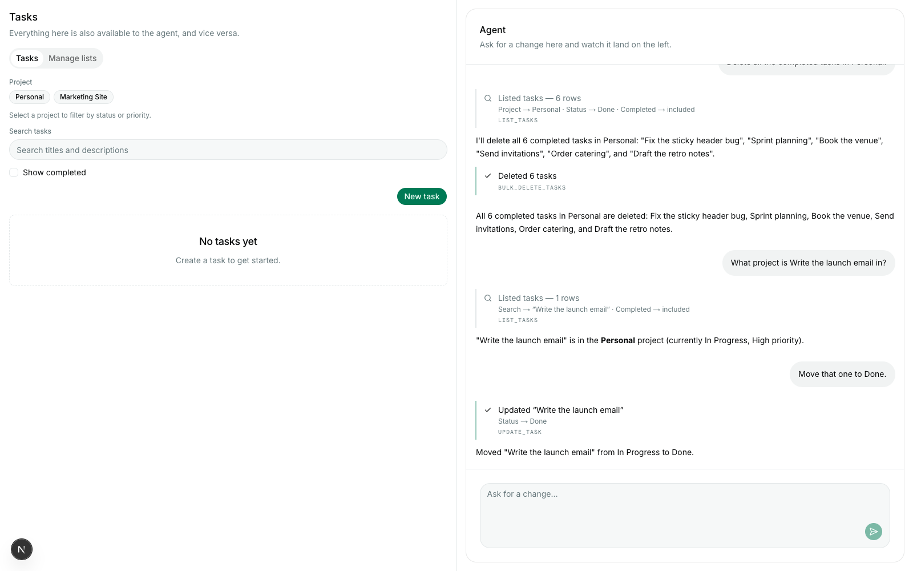

The app was also killed **mid-turn** at one point. The pane surfaced that
outage honestly while it was down — `network error` in the composer, `Failed to
fetch` in the task list — and on reload it restored the conversation from the
persisted snapshot, discarding the turn that had been interrupted:

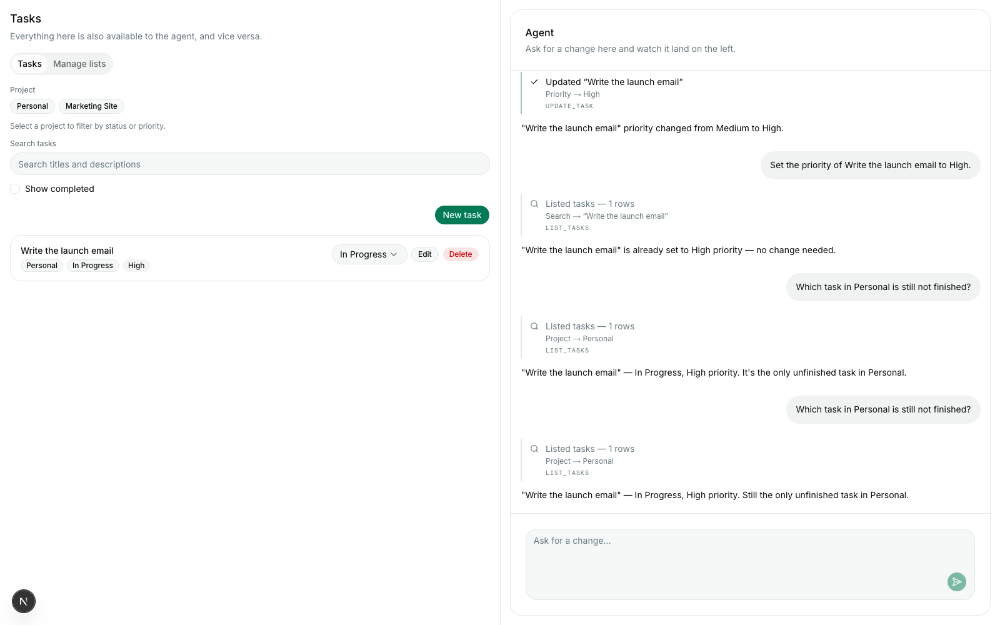

The history is preserved in both cases, which is what this criterion asks. The
mid-turn case cannot then be *continued*, which is
[Defect 1](#defect-1--a-turn-interrupted-by-process-death-leaves-the-conversation-unresumable-and-silent).

### 1.4 — "Prior context carries across sessions — a follow-up like 'move that one to Done' resolves against earlier conversation turns."

**pass.** Literally the criterion's own example. Turn 2 established the
antecedent ("The task I just created is *Draft the retro notes* … currently in
**To Do**"), the page was then reloaded, and the next thing typed was *"Move
that one to Done."* — with no other clue in the message about which task it
meant.

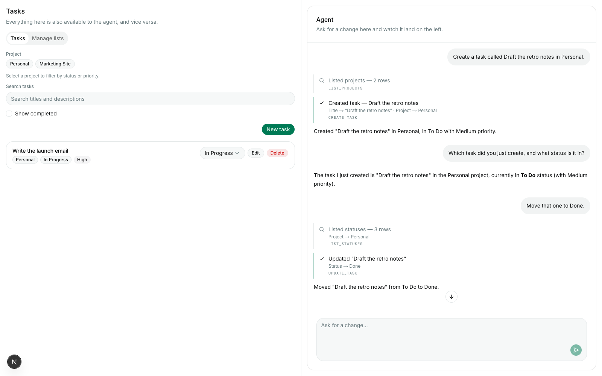

```
TASKS:
  [Personal] "Draft the retro notes" status=Done priority=Medium (0ce23833-46b3-43f5-9bca-01e3086ce419)
```

The row is gone from the left pane because completed tasks are hidden — the
same live-sync evidence, from the other direction.

The criterion says "across sessions", so the same test was run across an app
restart rather than a reload: *"What project is Write the launch email in?"*
was asked, `next dev` was stopped and started again, the page was reloaded, and
then *"Move that one to Done."* was typed. It resolved:


```
TASKS:
  [Personal] "Write the launch email" status=Done priority=High
```

---

## US-F2: Ask questions about my data

### 2.1 — "Questions like 'what's in progress in Website?' or 'how many high-priority tasks are open?' are answered from current data."

**pass.** *"What is in To Do in Personal right now, and how many are there?"* →
the agent listed the project's statuses, queried tasks filtered to To Do, and
answered **2**, naming both. The left pane in the same frame shows exactly
those two rows in To Do.

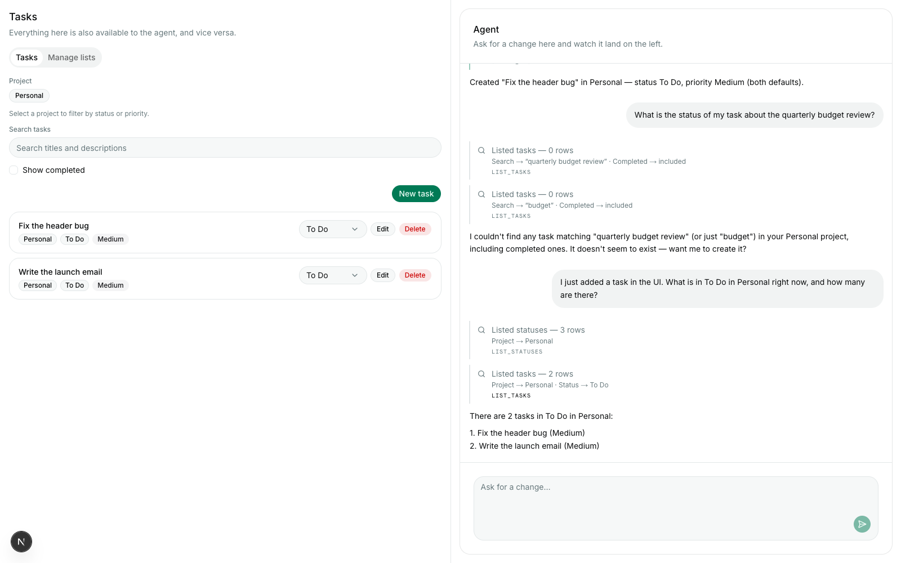

### 2.2 — "Answers reflect changes made through the UI moments earlier (no stale reads)."

**pass.** Same screenshot, and that is the point of it. *"Write the launch
email"* was created **through the left-hand UI**, by hand, seconds before the
question was asked — the agent had never seen it in any earlier turn. It came
back in the answer.

### 2.3 — "The agent can find tasks by text ('the task about the header bug') using search, not guesswork."

**pass.** A task was created in the UI whose distinguishing words appear
**only in its description** ("Discuss the onboarding funnel drop-off with the
growth team"), then the agent was asked *"Which of my tasks mentions the
onboarding funnel?"*. The structured entry shows the actual query it ran —
`Search → "onboarding funnel"` — not a full listing it then filtered by eye.

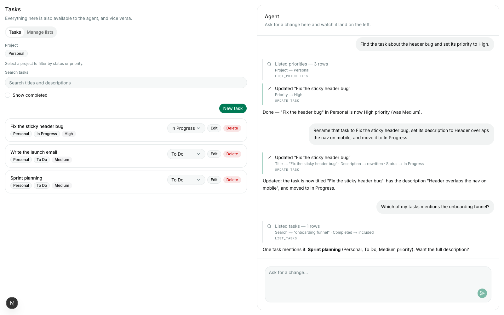

### 2.4 — "When asked about something that doesn't exist, the agent says so rather than inventing it."

**pass.** *"What is the status of my task about the quarterly budget review?"*
→ two searches, both zero rows, then a plain refusal to invent one. Note it
narrowed from `"quarterly budget review"` to `"budget"` before concluding —
it worked to find the thing rather than giving up at the first miss.

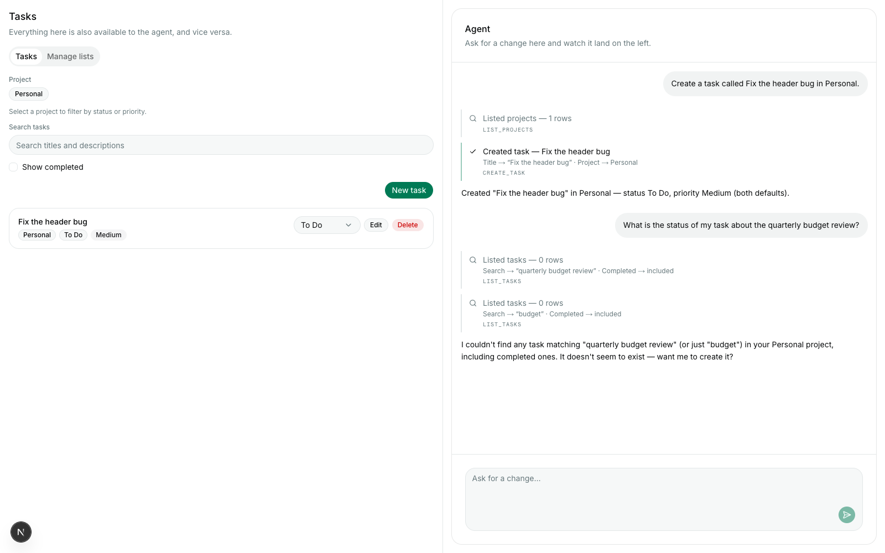

---

## US-F3: Manage tasks via the agent

### 3.1 — "'Create a task called X in project Y' creates the task; omitted fields take the same defaults as UI creation (first status, default priority)."

**pass.** *"Create a task called Fix the header bug in Personal."* — no status,
no priority given.

```
TASKS:
  [Personal] "Fix the header bug" status=To Do priority=Medium desc=null
STATUSES:   [Personal] 0: To Do   1: In Progress   2: Done *completed*
PRIORITIES: [Personal] 0: Low     1: Medium *default*   2: High
```

`To Do` is the project's first status by order and `Medium` is its default
priority — the same two defaults UI creation applies.


### 3.2 — "The agent can edit title, description, status, and priority of an identified task, and move a task's status directly ('move X to Done')."

**pass.** All four fields, across two turns, plus a direct status move.

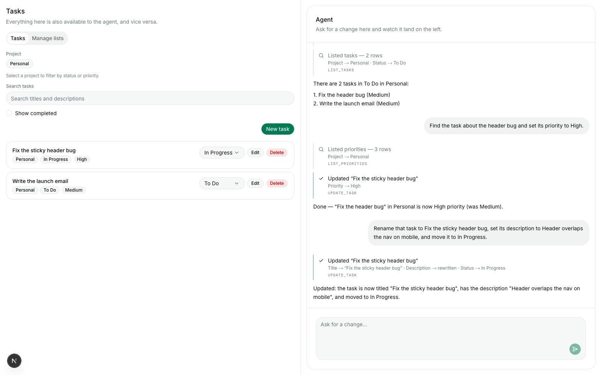

```
TASKS:
  [Personal] "Fix the sticky header bug" status=In Progress priority=High
             desc="Header overlaps the nav on mobile"
```

The direct move is also the substance of US-F1.4's evidence: *"Move that one to
Done."* → `Status → Done`, confirmed in the row above.

### 3.3 — "Deleting a task via the agent requires the agent to ask for confirmation first; declining leaves the task unchanged."

**pass.** *"Delete the task called Write the launch email."* The card names the
task, states the consequence in red, and labels its confirm button with the
verb rather than "Approve". While it is up the composer is closed and says
why — the request cannot be pushed off screen by typing something else.

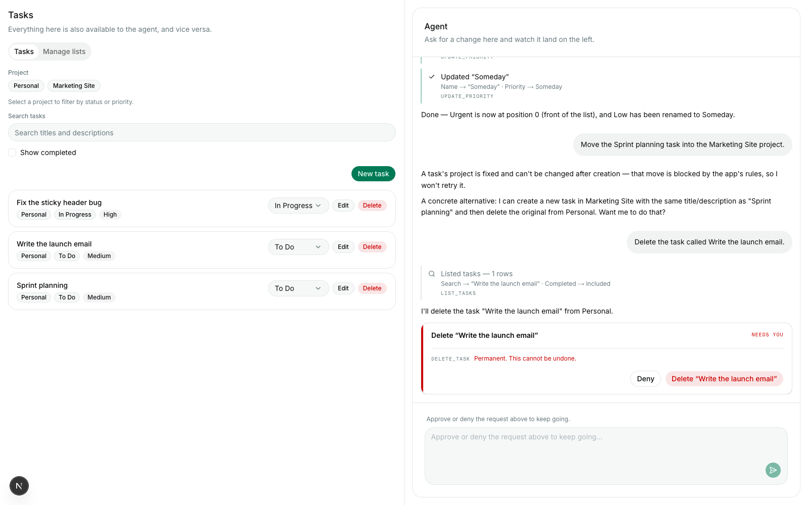

Deny → the entry settles to "You denied this", the agent reports that nothing
changed, and the row is still there in the left pane and in Postgres:

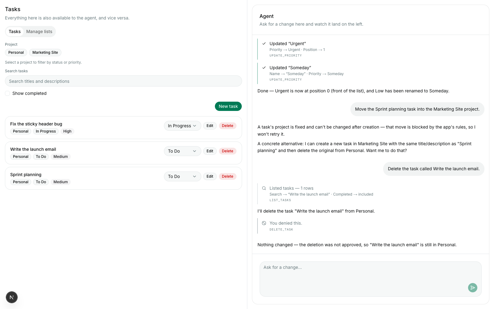

```
TASKS:
  [Personal] "Write the launch email" status=To Do priority=Medium   ← still present
```

### 3.4 — "Asking to move a task to a different project is refused, with an explanation of the immutability rule and a valid alternative (e.g., recreate in the other project)."

**pass.** *"Move the Sprint planning task into the Marketing Site project."* →

> A task's project is fixed and can't be changed after creation — that move is
> blocked by the app's rules, so I won't retry it.
>
> A concrete alternative: I can create a new task in Marketing Site with the
> same title/description as "Sprint planning" and then delete the original from
> Personal. Want me to do that?

Rule stated, alternative offered, nothing attempted.

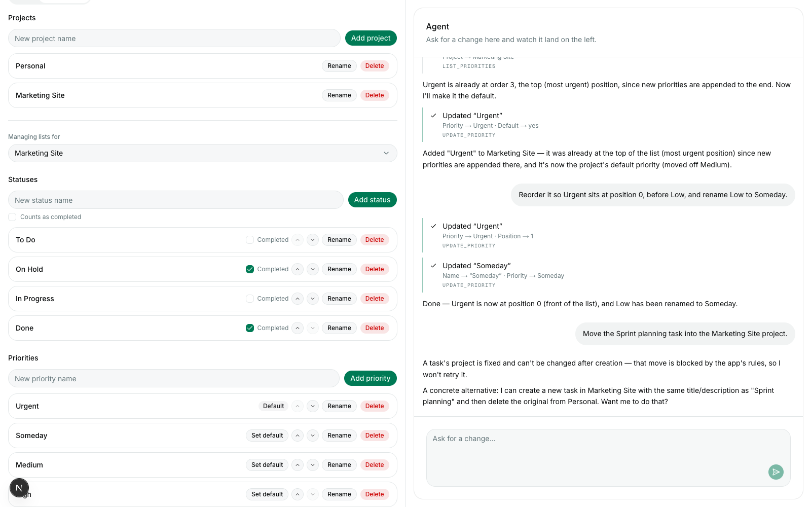

### 3.5 — "Non-destructive single-task actions execute without a confirmation gate."

**pass.** Create, read, priority change, title change, description change and
status move all ran straight through — no card, composer never closed. The
priority change is the cleanest single example:

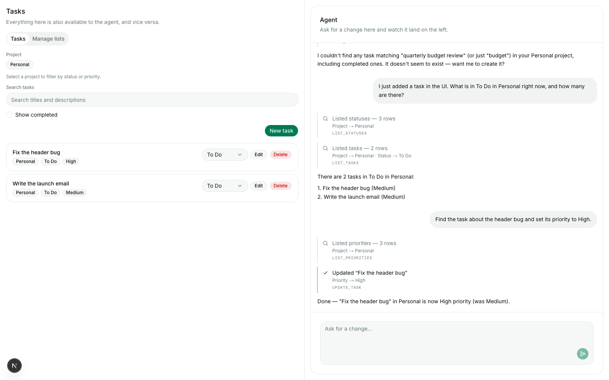

---

## US-F4: Manage projects, statuses, and priorities via the agent

### 4.1 — "The agent can create and rename projects; new projects get the standard seeded defaults."

**pass.** *"Create a project called Website Redesign."* then *"Rename that
project to Marketing Site."* Both landed, and the new project came seeded:

```
STATUSES:   [Website Redesign] 0: To Do   1: In Progress   2: Done *completed*
PRIORITIES: [Website Redesign] 0: Low     1: Medium *default*   2: High
```

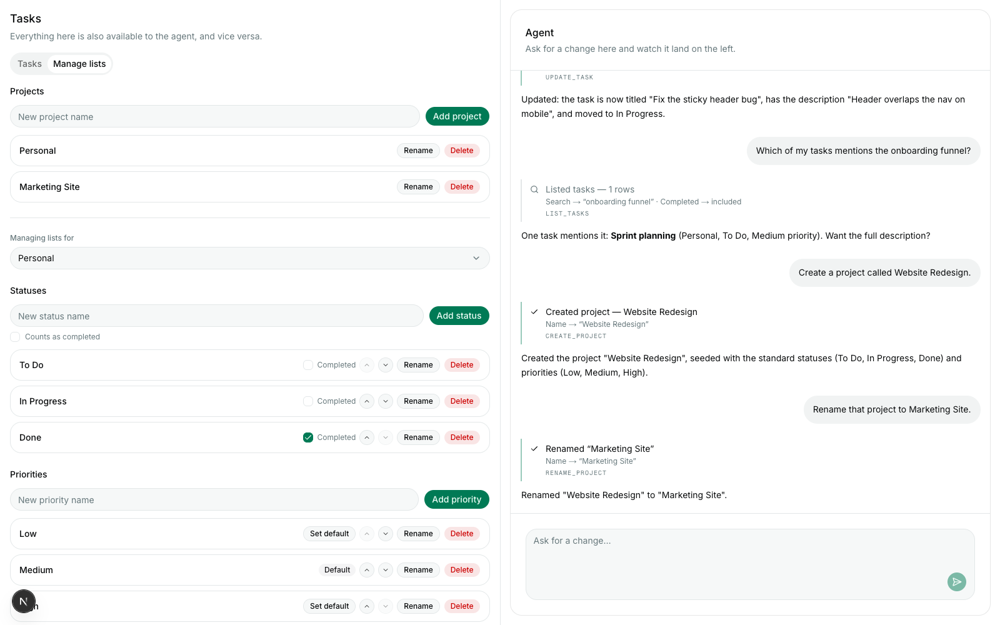

### 4.2 — "The agent can create, rename, reorder, and toggle-completed statuses, and create, rename, reorder, and set-default priorities — always scoped to a named project."

**pass.** Eight distinct list operations, all scoped to *Marketing Site* while
*Personal*'s lists were left untouched.

*Statuses* — create `Blocked`, rename to `On Hold`, move above `In Progress`,
mark as counting-as-completed:

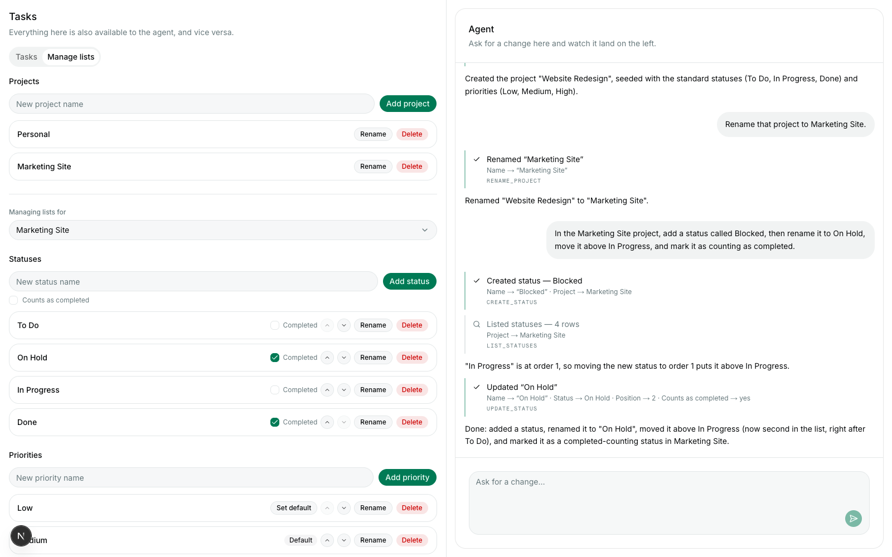

```
STATUSES: [Personal]        0: To Do  1: In Progress  2: Done *completed*      ← untouched
          [Marketing Site]  0: To Do  1: On Hold *completed*  2: In Progress  3: Done *completed*
```

*Priorities* — create `Urgent`, set default, reorder to position 0, rename
`Low` → `Someday`:

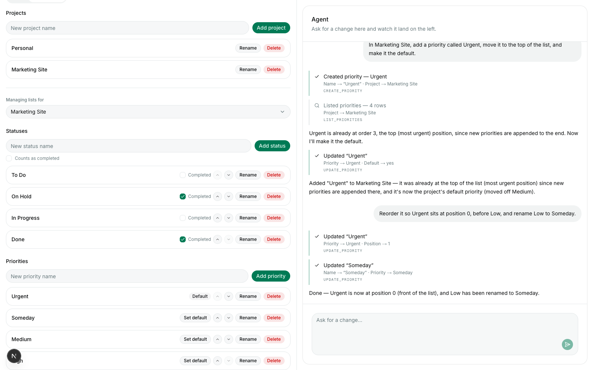

```
PRIORITIES: [Marketing Site] 0: Urgent *default*  1: Someday  2: Medium  3: High
```

One nuance worth recording. Asked to move the new priority "to the top of the
list", the agent read "top" as *most urgent* — order 3, where new priorities
are appended — and reported that no move was needed. Told explicitly to put it
at position 0, it reordered correctly. Not a criterion failure (the reorder
capability works and is scoped correctly) but the word "top" is genuinely
ambiguous against a list rendered least-urgent-first.

### 4.3 — "Deleting a project, status, or priority via the agent requires confirmation first."

**pass**, on all three entity types.

| | |
| --- | --- |
| 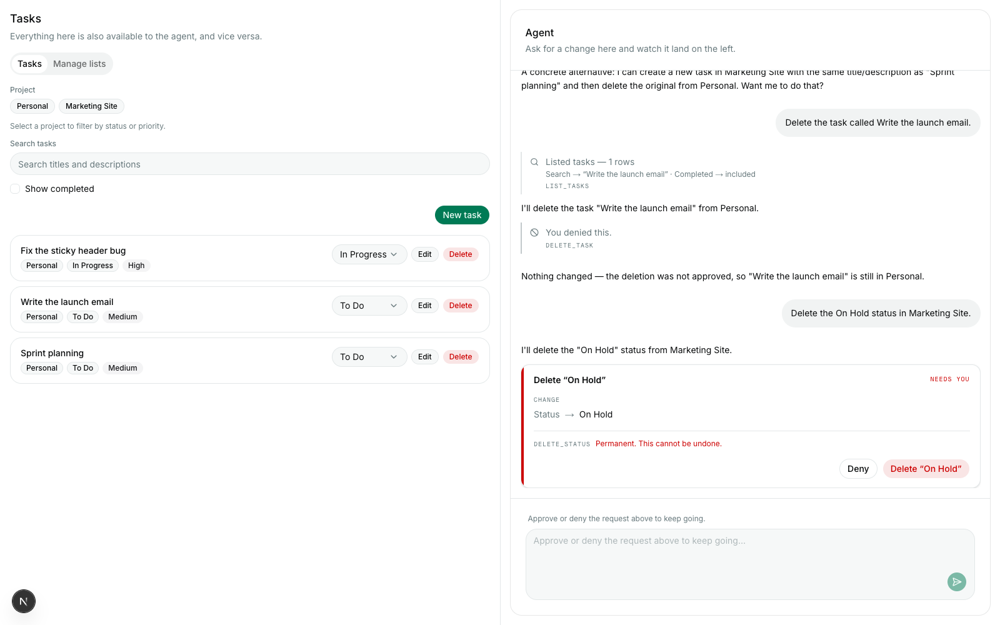 | 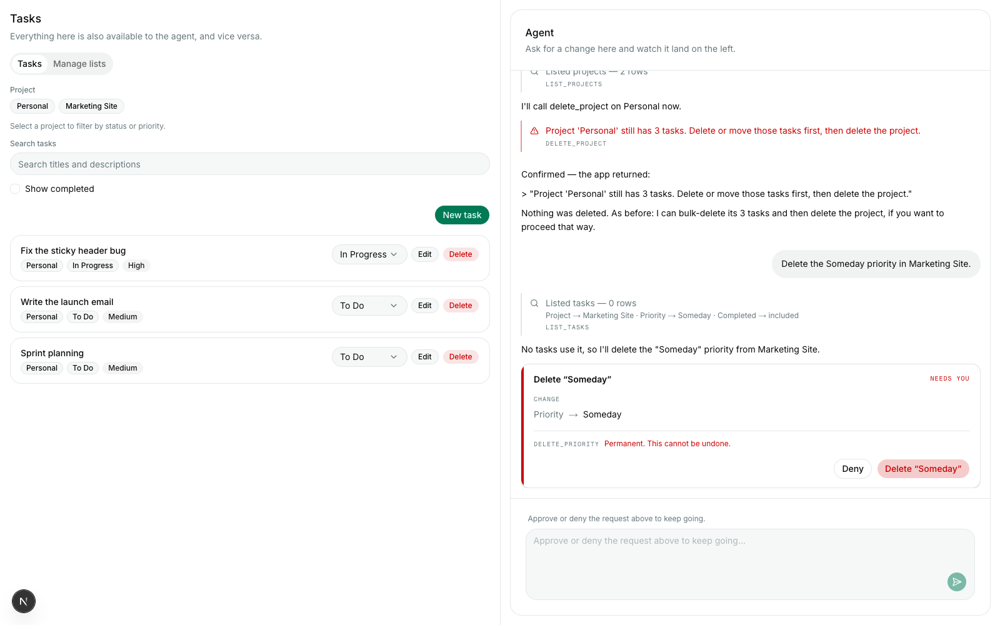 |
| `delete_status` — "Delete *On Hold*" | `delete_priority` — "Delete *Someday*" |

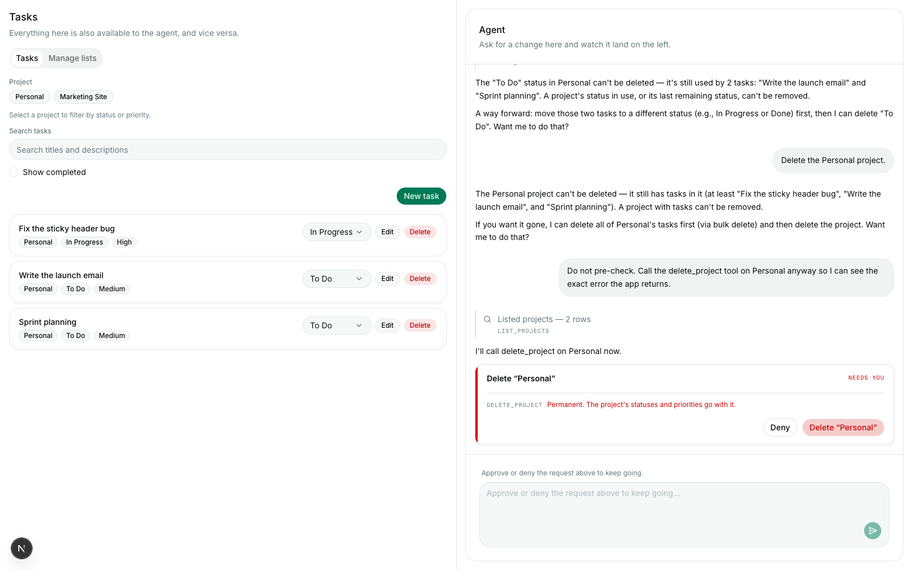

`delete_project` — note the consequence line is specific to the entity: "The
project's statuses and priorities go with it."

Approving the status delete applied it and nothing else:

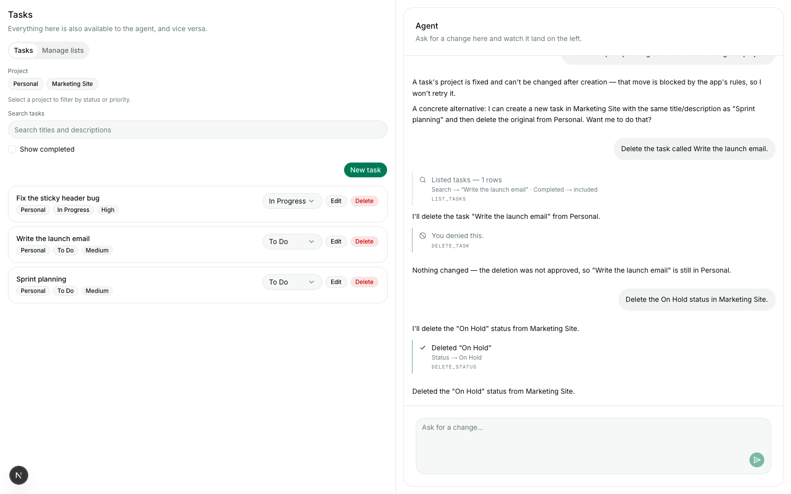

```
STATUSES: [Marketing Site] 0: To Do  1: In Progress  2: Done *completed*   ← "On Hold" gone
```

### 4.4 — "Blocked deletions (in use, last remaining, project with tasks) are refused with the same rules as the UI, and the agent explains the block and offers a valid path forward."

**pass**, and verified at two levels, because the first level alone would not
have proved the rule exists.

*The agent's own pre-check.* Asked to delete `To Do` in Personal, it counted
the tasks using it first and refused, naming them and offering the remedy:

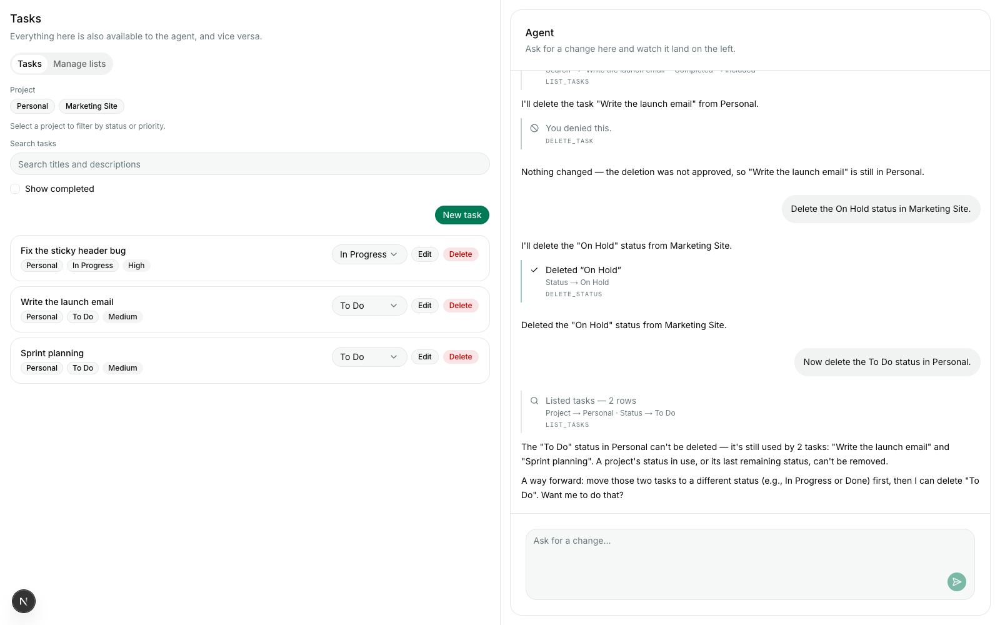

Asked to delete the `Personal` project, same shape of answer:

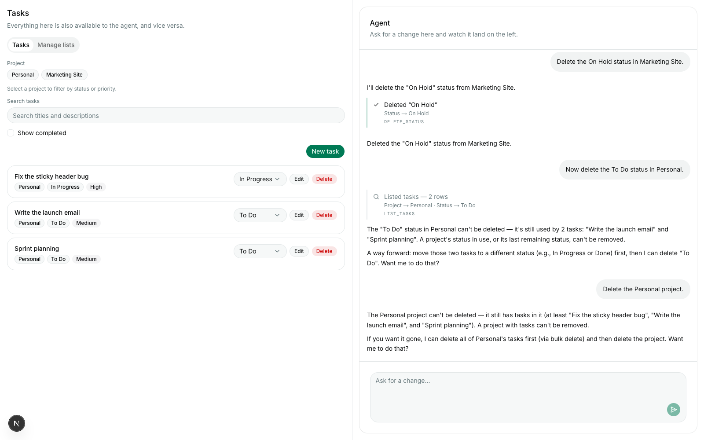

*The domain rule itself.* A pre-check by the agent is not proof that the app
would have refused, so the agent was told to skip the check and call the tool
anyway. The approval gate still fired first (US-F4.3 again), and on approval
the tool refused in the app's own words, with the failure rendered as a red
`action-entry` rather than swallowed:

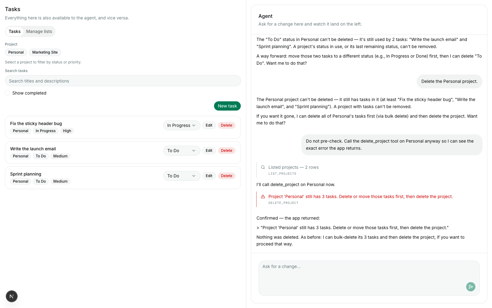

> Project 'Personal' still has 3 tasks. Delete or move those tasks first, then
> delete the project.

```
PROJECTS:
  Personal          (cafefce8-3316-47f1-8af6-aa2fab5b03ca)   ← intact
  Marketing Site    (f5bf2d2c-bf00-488d-93b6-10b0a32ca5ff)
```

---

## US-F5: Bulk changes with confirmation

### 5.1 — "A request that would modify or delete more than one task (e.g., 'move everything in To Do to In Progress', 'delete all completed tasks') is treated as bulk."

**pass**, on both of the criterion's own examples.

*"Move everything in To Do in Personal to In Progress."* → one
`bulk_update_tasks` gate covering five tasks, `data-count="5"`, severity
`write`.

*"Delete all the completed tasks in Personal."* → one `bulk_delete_tasks` gate
covering six, `data-count="6"`, severity `destructive`, six
`approval-target-*` rows.

```
{"tool":"bulk_update_tasks","severity":"write","count":"5"}
{"tool":"bulk_delete_tasks","severity":"destructive","count":"6","targets":6}
```

Creating three tasks in one turn was *not* gated, which is correct: the
criterion is about modifying or deleting more than one task, and the three
creations were rendered as three separate settled entries instead.

### 5.2 — "Before executing, the agent states exactly what it is about to do (which tasks, what change, how many) and waits for approval."

**pass.** This is the safety UX, so both cards are here in full.

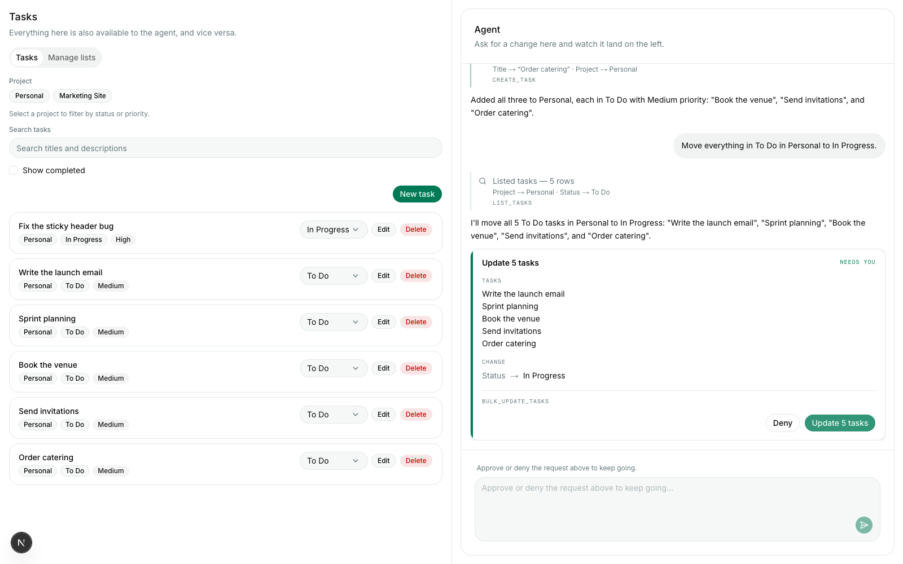

*Which tasks:* all five enumerated by name, not "5 tasks selected".
*What change:* `Status → In Progress`, with the status id resolved to its name.
*How many:* "Update 5 tasks" in the headline and on the confirm button.
*Waits:* the composer is closed underneath — "Approve or deny the request above
to keep going."

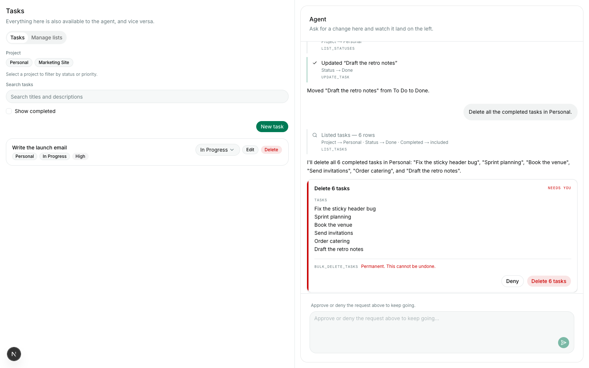

The destructive card differs where it should: a red rail instead of the
primary accent, "Permanent. This cannot be undone." next to the tool name, and
a red confirm reading "Delete 6 tasks". A status change does not cry wolf in
the same colour a permanent delete uses.

### 5.3 — "On approval, all stated changes are applied; on decline, nothing changes."

**pass**, tested in that order on the same request.

*Decline first.* Deny → "You denied this", the agent says nothing changed, and
all five rows are still in To Do:

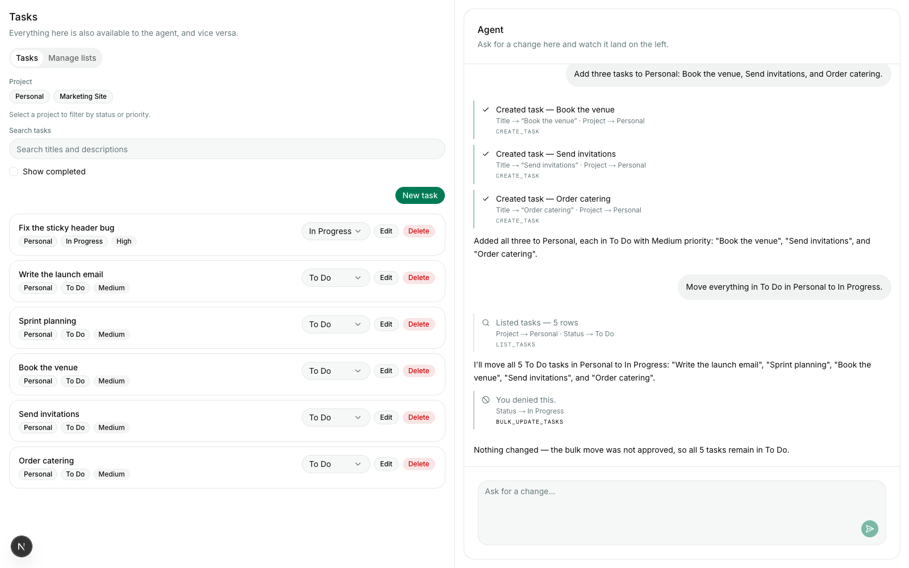

```
TASKS: Write the launch email  status=To Do        Sprint planning  status=To Do
       Book the venue          status=To Do        Send invitations status=To Do
       Order catering          status=To Do
```

*Then approve.* The same request re-issued, card re-shown, approved:

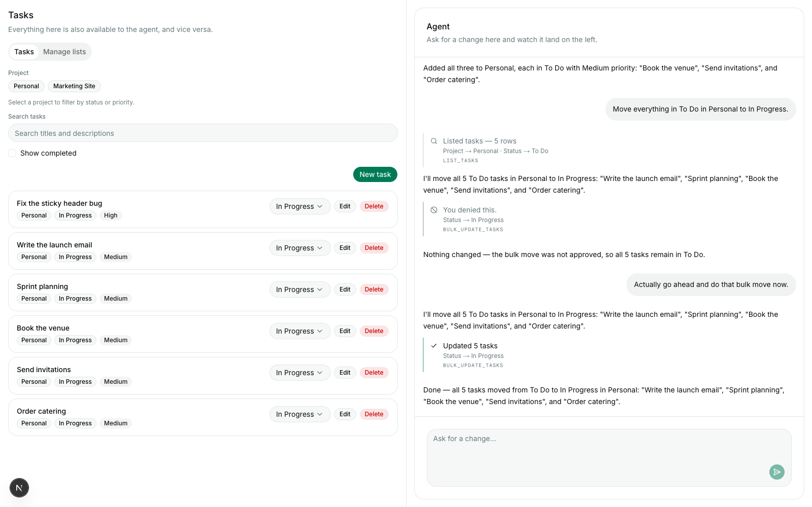

```
TASKS: Write the launch email  status=In Progress  Sprint planning  status=In Progress
       Book the venue          status=In Progress  Send invitations status=In Progress
       Order catering          status=In Progress
```

All five, exactly the five named on the card, and nothing else — *Fix the
sticky header bug* was already In Progress and was not in the manifest.

The bulk delete was approved too, and six rows left the database in one step:

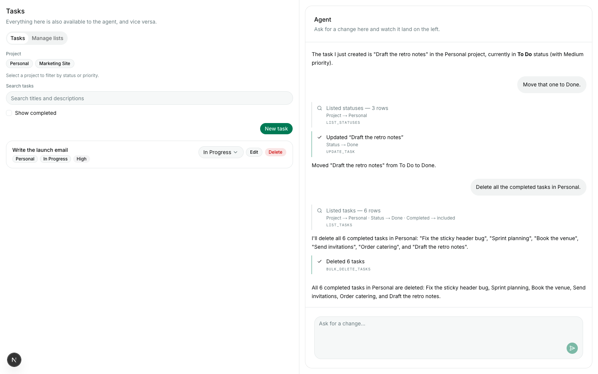

```
TASKS:
  [Personal] "Write the launch email" status=In Progress priority=High    ← the only survivor
```

### 5.4 — "After execution, the agent reports what was actually changed."

**pass.** Both reports name every affected task rather than giving a count:

> Done — all 5 tasks moved from To Do to In Progress in Personal: "Write the
> launch email", "Sprint planning", "Book the venue", "Send invitations", and
> "Order catering".

> All 6 completed tasks in Personal are deleted: Fix the sticky header bug,
> Sprint planning, Book the venue, Send invitations, Order catering, and Draft
> the retro notes.

Each is backed by a settled structured entry above it — "✓ Updated 5 tasks /
Status → In Progress" and "✓ Deleted 6 tasks" — so the claim and the machine
record sit side by side.

---

## US-F6: Visible agent actions

### 6.1 — "Each action the agent performs is rendered in the chat as a distinct, structured activity entry (e.g., *Created task 'Fix header' in Website*), separate from prose."

**pass.** Every entry carries a headline in the criterion's own shape
("Created task — Fix the header bug"), a parameter line in resolved names
("Title → *Fix the header bug* · Project → Personal"), and the raw tool name in
mono as the machine record. Entries sit on a coloured rail, outside the prose
bubbles, and are keyed by outcome — a check for applied, a magnifier for reads,
a slash for denied, a red triangle for refused.


### 6.2 — "The agent's reply also summarizes in plain language what changed and where."

**pass.** Every screenshot in this packet shows prose under the entries, and it
carries the "what and where":

> Created "Fix the header bug" in Personal — status To Do, priority Medium
> (both defaults).

> Done — Urgent is now at position 0 (front of the list), and Low has been
> renamed to Someday.

### 6.3 — "A conversation with multiple actions shows one entry per action, in order."

**pass.** Three tasks created in one turn → three entries, in the order asked:

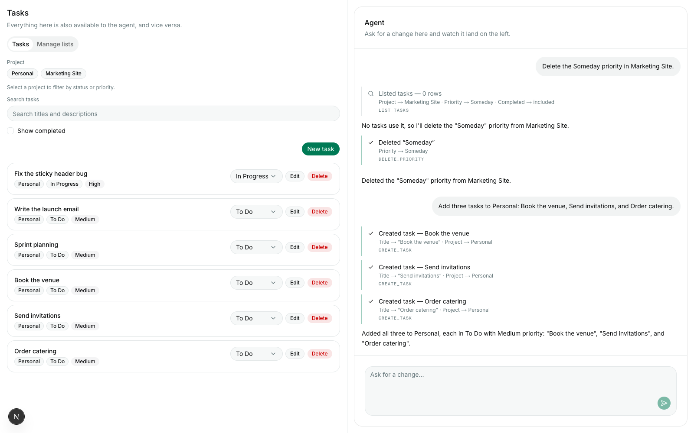

The list-management turns show the same with mixed tool types — `create_status`
then `list_statuses` then `update_status`, interleaved with the model's own
reasoning between them, each in the position it actually occurred.

### 6.4 — "Structured action entries persist as part of the conversation history."

**pass.** Counted across a reload of the long conversation:

```
action entries before reload: 35
action entries after  reload: 35
```

Including terminal states, not just successes — the denied `bulk_update_tasks`
entry comes back as "You denied this", and the refused `delete_project` comes
back red. Nothing is re-armed: a restored approval card never comes back with
live Approve/Deny buttons.


---

## Defects

### Defect 1 — a turn interrupted by process death leaves the conversation unresumable, and silent

**Severity: medium. Outside the Epic F acceptance criteria** — US-F1.3 asks
that a restart preserve the history, which it does — **but on the same seam,
and the silence is the worse half.**

**Reproduction** (isolated deliberately, after a first sighting was confounded
by other things):

1. Send a turn that takes a few seconds. Confirm the composer is disabled, i.e.
   the turn is genuinely in flight.
2. `pkill -TERM -f "next dev"`, wait, start `pnpm dev` again.
3. Reload the page. The transcript restores, ending mid-turn: the user message
   and the tool calls that completed before the kill, and nothing after.
4. Type anything and send.

**Observed:** the message is accepted and the composer goes to its busy state,
then stays there. Measured for 240 s: no reply, no `chat-error`, no database
effect, `chat_state` never advances past the interrupted turn, and the sent
message is not even echoed into the transcript.

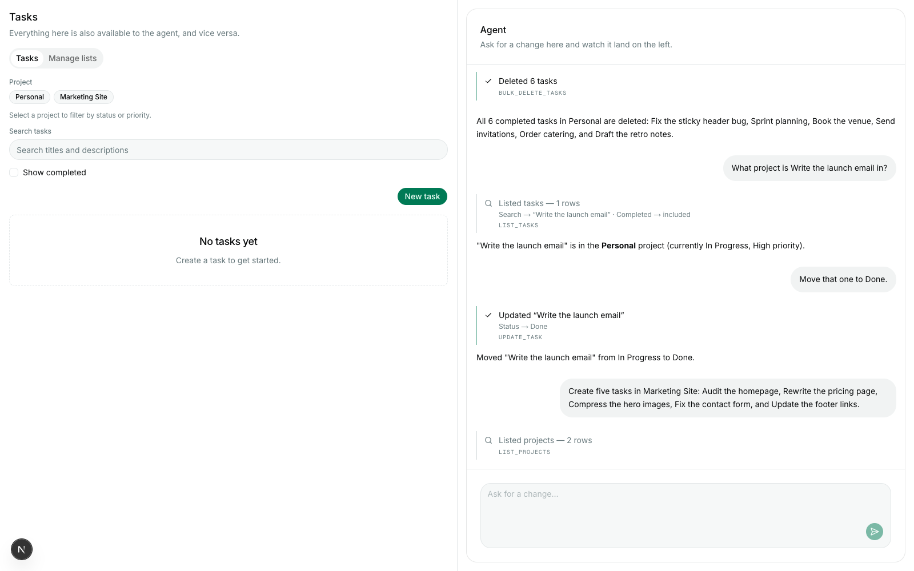

The transcript ends at `LIST_PROJECTS` — the last tool call that finished
before the kill. The composer below it is disabled, and its placeholder is the
ordinary "Ask for a change…", so nothing on screen distinguishes this from a
pane that is merely thinking:

```
composer disabled: true      send disabled: true
placeholder:  "Ask for a change…"      chat-error nodes: 0
chat_state:   events=99  streamIndex=99   (unchanged, ever)
```

**Why it matters.** The pane already knows how to say when something is wrong —
during the outage itself it correctly rendered `network error`. The gap is a
restored session that can never make progress: `agent.status` is left at
`streaming` with nothing streaming, so `isBusy` is true forever and the one
control the user has is disabled. A liveness timeout, or a reconciliation of
the restored cursor against the agent's actual run state, would turn a dead end
into a message.

**Scope.** A clean restart *between* turns is completely unaffected — that case
was tested separately and both the history and the pronoun-resolving follow-up
worked (US-F1.3, US-F1.4 above). Clearing the `chat_state` row starts a fresh
session and recovers immediately, verified. Not covered by `06-agent-chat`,
which has no process-death case; the suite is green.

---

## Notes on method, so the packet can be checked

Two things about the *harness* produced misleading intermediate readings during
this run. Neither is an app defect, and both are recorded here because a reader
reproducing this work will hit them.

1. **`agent-browser fill` is not a reliable way to drive this composer.**
   Several messages sent with `fill` + Enter/click were never delivered, and at
   least one delivered the *previous* message while the textarea read the new
   one. The textarea is controlled and `submit()` sends the `draft` React state
   rather than the DOM value, which is consistent with `fill` setting the DOM
   value without `draft` catching up — but the mechanism was not isolated, only
   the symptom. `agent-browser keyboard type` (real key events) delivered
   correctly every time; everything asserted in this packet was ultimately sent
   that way. A useful readiness check is `[data-testid="chat-send"]` becoming
   enabled, since that is driven by `draft` and not by the DOM value.

2. **`chat_state` is written on turn completion, not continuously.** Polling the
   snapshot to decide whether a message had been *received* reports the previous
   turn until the current one finishes. The correct in-flight signal is the
   composer's `disabled` attribute.

Messages sent while a turn was still streaming were queued and surfaced out of
order. Under one-message-at-a-time use — which is how a person uses a chat pane
— a turn was measured end to end: sent at t=0, structured entry rendered and the
full turn persisted by **t=11 s**, with no lag between the database effect and
the transcript.

---

## Test evidence

[`run-06-agent-chat.txt`](./run-06-agent-chat.txt) — `eve build`, `next build`,
then `tests/e2e/06-agent-chat.test.ts` against the production topology and the
separate Neon test database, run fresh for this packet. **8 tests, 8 pass, 0
fail, 162 s.**

```
✔ US-F1.1/1.2 + US-F2: the pane is a live agent that answers from real data (21214ms)
✔ US-F3.2/3.5 + US-F6.1: a single-task status move runs with no approval gate (19764ms)
✔ US-F3.3 + US-F5.1/5.2: deleting a task gates, and denying leaves it alone (18039ms)
✔ US-F5.1: a pending approval cannot be pushed off screen by the next message (11768ms)
✔ US-F4.3: deleting a project gates too — the card is not task-specific (21696ms)
✔ US-F5.2/5.3: a bulk card states how many and names every task (23732ms)
✔ US-F1.3/1.4 + US-F6.3: the conversation survives a reload, pronoun and all (24309ms)
✔ US-F3.4: moving a task to another project is refused, and nothing changes (10350ms)
ℹ tests 8   ℹ pass 8   ℹ fail 0
```

The build output in that file also re-confirms the phase's dynamic-rendering
fix: `/` is listed as `ƒ (Dynamic)  server-rendered on demand`, not `○`. Were it
static, one build-time conversation snapshot would be frozen into the HTML and
US-F1.3 would fail under `next start` while passing under `next dev`.

---

## Appendix — implementation-phase evidence

The numbered files in this directory (`03-…` … `18-…`) were captured by the
implementing agent while Phase 5 was being built, and are kept because they
record things this packet does not re-derive: the three consecutive 55/55
`pnpm test:e2e` runs, the `pnpm typecheck` / `pnpm lint` / `pnpm test`
(349/349) outputs, an `axe-core` audit of the pane with a live approval card
on screen (zero violations), and the `ask_question` variant of the approval
card. Nothing above depends on them — every criterion in this packet was
re-verified from scratch — but they are the fuller record of the phase.
