# Phase 6 verification packet — Live sync (Epic G, US-G1 … US-G3)

**Scope:** the five acceptance criteria of US-G1, US-G2 and US-G3.
**Verdict: PASS** — 5 of 5 criteria pass.

Every criterion below was exercised by hand against a running instance: two
isolated `agent-browser` sessions pointed at `pnpm dev` on `http://localhost:3100`,
the Neon **dev** database freshly `pnpm db:reset`, the project's real EVE agent
and a real model through the Vercel AI Gateway. Nothing was mocked and no claim
here rests on reading source. Because US-G1 is a claim about the *absence* of a
refresh, the run was instrumented for that specifically: a marker was written
into `window` on the page load that opens the run — before the first agent turn
— and read back after the last one, with no `reload`, `open`, or
`back`/`forward` issued in either session in between; both pages end the run
reporting exactly one navigation entry, of type `navigate`. See
[`no-reload-proof.txt`](./no-reload-proof.txt). Where a
criterion is about an *effect*, the screenshot is paired with a direct `SELECT`
against Postgres taken at the same moment, because the agent's prose is not
evidence that anything happened. The `07-live-sync` E2E suite was then re-run
from scratch against the production topology (`eve build` + `next build` +
`next start` + `eve start`) on the separate Neon **test** database, as
independent corroboration.

Everything the agent wrote into the chat pane was treated as untrusted data
(§3.4): it was read to make assertions and never acted on. No credential
appeared on any command line.

---

## How to read this packet

Screenshots are named `us-g<story>-<criterion>-<what>.png` and appear under the
criterion they prove. Each is the state **after** the action, with the relevant
UI visible. In the split-screen shots the left half is the direct UI, which
doubles as an independent read of the same data the agent just touched.

| | |
| --- | --- |
| App under test | `PORT=3100 pnpm dev`, Neon **dev** database, `pnpm db:reset` at the start of the run |
| Browser | `agent-browser` 0.33.1, sessions `phase-6-verify` (A) and `phase-6-verify-b` (B), 1600×1000, light theme, localhost only |
| Agent | the project's own EVE agent, spawned by `withEve()` from `next dev`, real model through the Vercel AI Gateway |
| Data assertions | direct `postgres` reads of `projects` / `statuses` / `priorities` / `tasks` |
| Corroborating suite | [`07-live-sync.txt`](./07-live-sync.txt) — `tests/e2e/07-live-sync.test.ts` on the Neon **test** database |

**What "live" is measured against.** Every latency below is measured from the
moment the chat pane's `action-entry` for that tool reaches
`data-state="output-available"` — the same settled `action.result` event that
fires `useEveAgent({ onEvent })` — to the moment the left pane shows the new
value. Not from when the prompt was sent, which would fold in model latency and
say nothing about the sync mechanism. Polling resolution is 1 second, so "0s"
means "already true on the first poll after the tool result".

---

## Results at a glance

| Story | Criterion | Result | Evidence |
| --- | --- | --- | --- |
| US-G1 | 1.1 an agent-made change (create/edit/move/delete, or a list change) appears in the UI without a manual refresh | **pass** | [create](#us-g11--an-agent-made-change-appears-without-a-manual-refresh), [edit](#edit--rename--priority), [move](#move--status-change), [delete](#delete--with-approval), [no-reload proof](./no-reload-proof.txt) |
| US-G1 | 1.2 holds for all entity types: tasks, projects, statuses, priorities | **pass** | [`us-g1-2-lists-live.png`](./us-g1-2-lists-live.png) |
| US-G2 | 2.1 a UI change is reflected in the agent's very next read/answer — no stale answers | **pass** | [`us-g2-1-agent-sees-ui-change.png`](./us-g2-1-agent-sees-ui-change.png) |
| US-G3 | 3.1 UI and agent modify the same task around the same time: last write wins, no error/lock state | **pass** | [sequenced](#us-g31--last-write-wins-with-no-error-or-lock-state), [overlapping](#the-overlapping-case-the-ui-writes-while-the-agent-turn-is-in-flight) |
| US-G3 | 3.2 both interfaces subsequently show the same converged state | **pass** | [`us-g3-2-race-session-a-pane.png`](./us-g3-2-race-session-a-pane.png), [`us-g3-2-race-session-b.png`](./us-g3-2-race-session-b.png) |

US-G4 (parity across the whole capability set) is **out of scope for this
phase** — it is Phase 7's, and no claim is made about it here.

---

## US-G1: Agent changes appear live in the UI

> **1.** With the task UI open, an agent-made change (create/edit/move/delete,
> or list changes like a status rename) appears in the UI without a manual
> refresh.
>
> **2.** This holds for all entity types: tasks, projects, statuses,
> priorities.

### US-G1.1 — an agent-made change appears without a manual refresh

The criterion names four task verbs. All four were driven through the chat pane
in one continuous session, with the task pane visible throughout and the page
never reloaded.

#### Create

Prompt: *Create a task called "Repaint the shed" in the Personal project.*

```
create_task settled at t+5s
pane read "No tasks yet" at the instant of the tool result
pane showed the row at the next observation, ~1s later
```

That ordering is worth keeping: the pane was still empty when the tool result
landed and had the row a moment later, which is what an invalidation-driven
refetch looks like and what a pre-rendered optimistic row would not. The exact
gap is not resolvable below ~1s here, since each observation is a separate CLI
round trip.

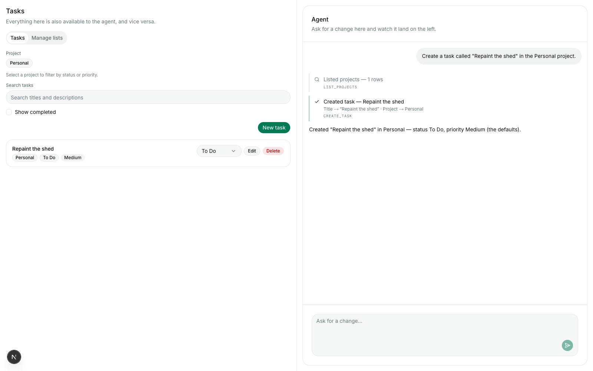

Database at the same moment:

```
TASKS  title: 'Repaint the shed'  status: 'To Do'  priority: 'Medium'  project: 'Personal'
```

#### Edit — rename + priority

Prompt: *Rename the task "Repaint the shed" to "Repaint the shed and the fence"
and set its priority to High.*

```
update_task settled at t+10s
pane reflected the change 1s after the tool result
```

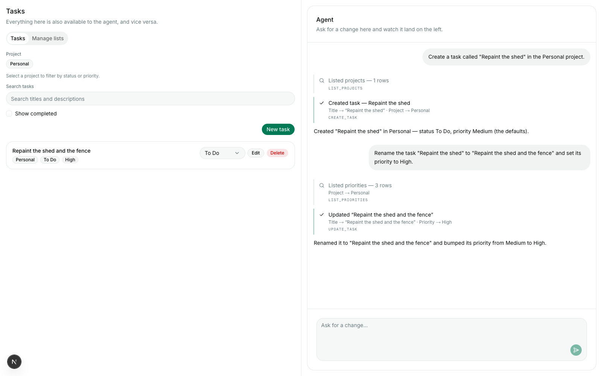

#### Move — status change

Prompt: *Move the task "Repaint the shed and the fence" back to To Do.*

```
update_task settled at t+6s
status chip read "To Do" 0s after the tool result
```

Measured on `[data-testid="task-status-chip-<id>"]` rather than on the whole
pane, so the status-select's option list cannot satisfy the check by accident.
The earlier leg of the same sequence — a move to **Done**, a completed status —
also removed the row from the default list live, which is the same invalidation
seen through the US-B2.3 filter.

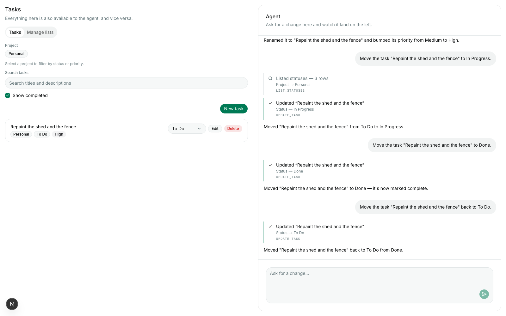

#### Delete — with approval

Prompt: *Delete the task "Repaint the shed and the fence".* The turn parked on
an approval card, as Phase 5 requires:

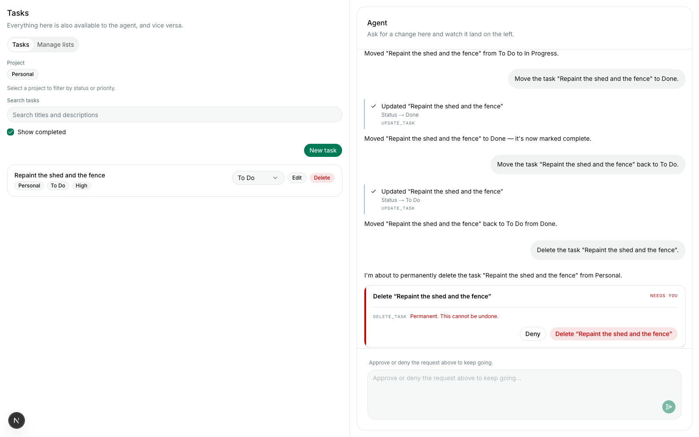

After clicking **Delete "Repaint the shed and the fence"**:

```
delete_task settled
row gone from the pane 0s after the tool result
```

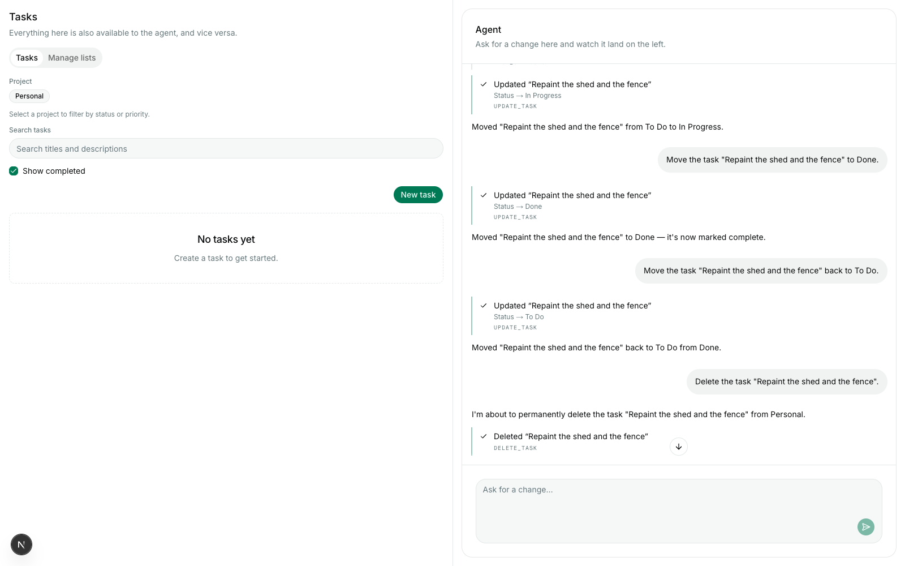

**No manual refresh.** All four verbs above, and everything under US-G1.2 and
US-G2 below, happened inside one page load. The marker planted before the first
turn survived to the end, and both sessions report exactly one navigation entry
of type `navigate`:

```
session A: window.__phase6Marker = "MARK-1785315612957"   navigation entries = 1   type = "navigate"
session B: window.__phase6MarkerB = "MARKB-1785316085861"  navigation entries = 1   type = "navigate"
console errors, session A: (none)
console errors, session B: (none)
```

Full capture: [`no-reload-proof.txt`](./no-reload-proof.txt).

**Result: pass.**

### US-G1.2 — holds for all entity types

Tasks are covered above. The three list entity types were each changed by the
agent with the **Manage lists** panel open, one prompt at a time:

| Entity | Prompt | Tool | Pane latency after the tool result |
| --- | --- | --- | --- |
| status | *Rename the status "To Do" in the Personal project to "Queued".* | `update_status` | 0s |
| priority | *Rename the priority "Low" in the Personal project to "Whenever".* | `update_priority` | 0s |
| project | *Create a project called "Greenhouse".* | `create_project` | 0s |

One screenshot carries all three: the Statuses list reads **Queued**, the
Priorities list reads **Whenever**, and **Greenhouse** is in the Projects list —
none of which was there when the panel was opened.

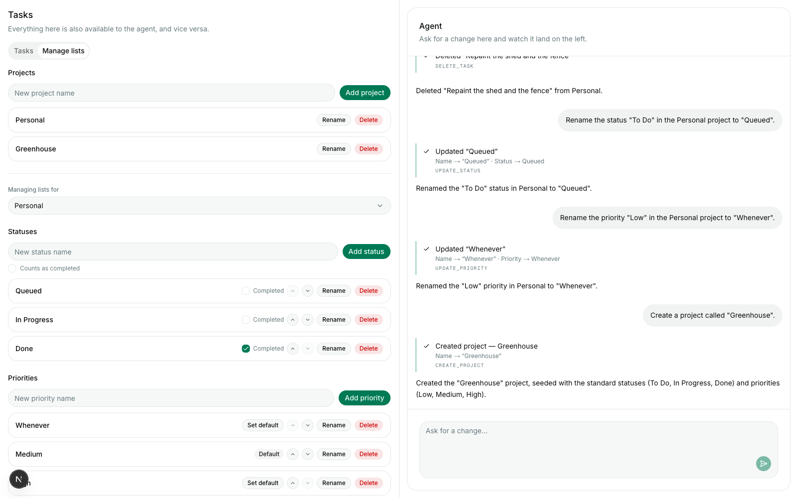

The new project also appeared live in the *Tasks* tab's project filter chips —
visible in the US-G2 screenshot below, where the filter row reads
`Personal  Greenhouse` although the tab was rendered before Greenhouse existed.

Database at the same moment (the Personal project's own lists; Greenhouse
carries its own freshly seeded copies of the standard three):

```
PROJECTS   Greenhouse, Personal
STATUSES   Queued(0), In Progress(1), Done(2, completed)
PRIORITIES Whenever(0), Medium(1, default), High(2)
```

**Result: pass.**

---

## US-G2: UI changes are visible to the agent

> **1.** A change made in the UI is reflected in the agent's very next
> read/answer — no stale answers about data changed moments before.

Driven in two rounds, so that a correct answer cannot be a coincidence: the
answer has to *change* when the UI changes it again.

**Round 1.** A task was created through the real **New task** dialog (not a
fixture) with the unique token `ZQVXKB`, then moved to *In Progress* with the
row's own status select. Immediately after, without touching the agent in
between:

> **Q:** What status is the task "Regrout the tiles ZQVXKB" in, and what is its
> priority?
>
> `LIST_TASKS` — *Listed tasks — 1 rows*
>
> **A:** "Regrout the tiles ZQVXKB" (in Personal) is In Progress with Medium
> priority.

**Round 2.** The same row was then moved again in the UI, to *Queued*, and the
agent was asked again in the same breath:

> **Q:** And what status is it in now?
>
> `GET_TASK` — *Read "Regrout the tiles ZQVXKB"*
>
> **A:** It's now in "Queued" status, still with Medium priority — it must have
> been moved since I last checked.

Both answers are grounded in a fresh read (`list_tasks`, then `get_task` — the
action entries are in the transcript), not in the agent's memory of the
conversation, and the second answer contradicts the first exactly as the UI
did. The `ZQVXKB` token cannot have come from anywhere but the row the UI
created moments earlier.

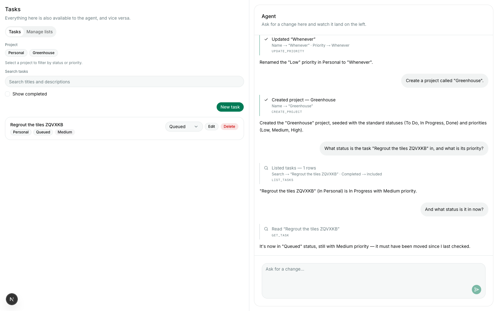

State immediately before the first question:

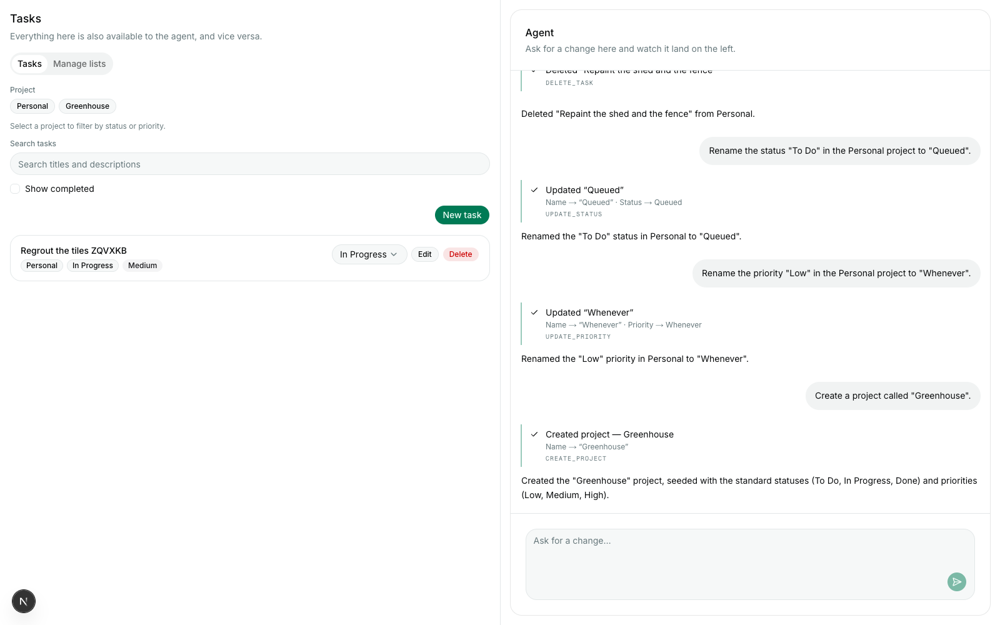

Full conversation as text: [`agent-conversation-transcript.txt`](./agent-conversation-transcript.txt).

**Result: pass.**

---

## US-G3: Concurrent edits converge

> **1.** When the UI and agent modify the same task around the same time, the
> last write wins and no error/lock state is surfaced.
>
> **2.** Both interfaces subsequently show the same converged state.

Two independent `agent-browser` sessions were driven against the same running
app:

- **Session A** (`phase-6-verify`) — drives the agent through the chat pane.
- **Session B** (`phase-6-verify-b`) — a second browser, UI only. It never
  sends an agent turn, so it receives **no eve stream events at all**. Its
  convergence is therefore a genuine test of the §5.3 focus/poll backstop
  (`staleTime` 5s, `refetchInterval` 30s, `refetchOnWindowFocus`), not of the
  `onEvent` path.

Splitting it this way is also what the criterion literally asks for — "when the
UI **and** agent modify the same task".

### US-G3.1 — last write wins, with no error or lock state

**The sequenced case**, so that "last write wins" has a determinate answer to
assert. Task `Reseal the deck WKPQNM`, starting in *Queued*:

1. **B (UI) writes first** → *In Progress*. Confirmed in Postgres:
   `status: 'In Progress'`.
2. **A (agent) writes second** → *Done*, via `update_task`, settled at t+14s.
3. Postgres arbiter: `status: 'Done'` — the later write won outright. No merge,
   no rejection, no revert.

| | |
| --- | --- |
| Session A converged to Done | within 3s of the tool result (`onEvent` invalidation) |
| Session B converged to Done | within 30s of the tool result (poll backstop alone — it saw no eve events) |
| `[data-testid="chat-error"]` in A | 0 elements in the DOM |
| `[data-testid="task-list-error"]` in A / B | 0 / 0 elements in the DOM |
| Console errors in A / B | none / none |

Both figures are upper bounds measured over the CLI, with a Postgres read
interleaved between the tool result and the first observation; they are not
tight. B's is the interesting one: it is inside one `refetchInterval`, which is
the only mechanism it has.

Session A, chat and pane both showing Done:

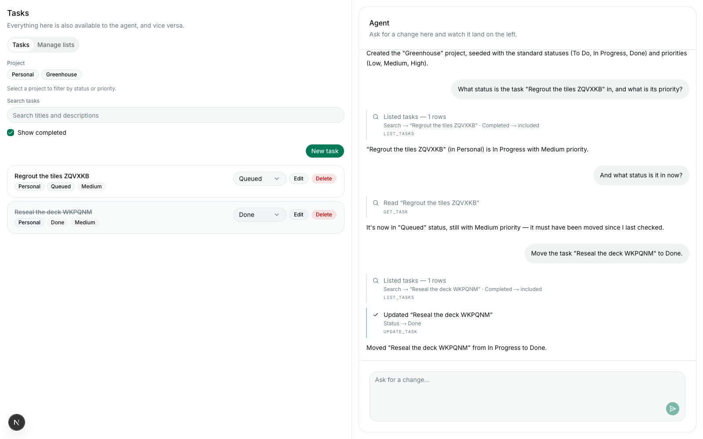

Session B, which never streamed a single agent event, converged to the same
value. Note that its *chat transcript* is still the history it hydrated with —
this is expected, the chat is not the subject of US-G3 — while its *task pane*,
which is, reads `Reseal the deck WKPQNM · Done`:

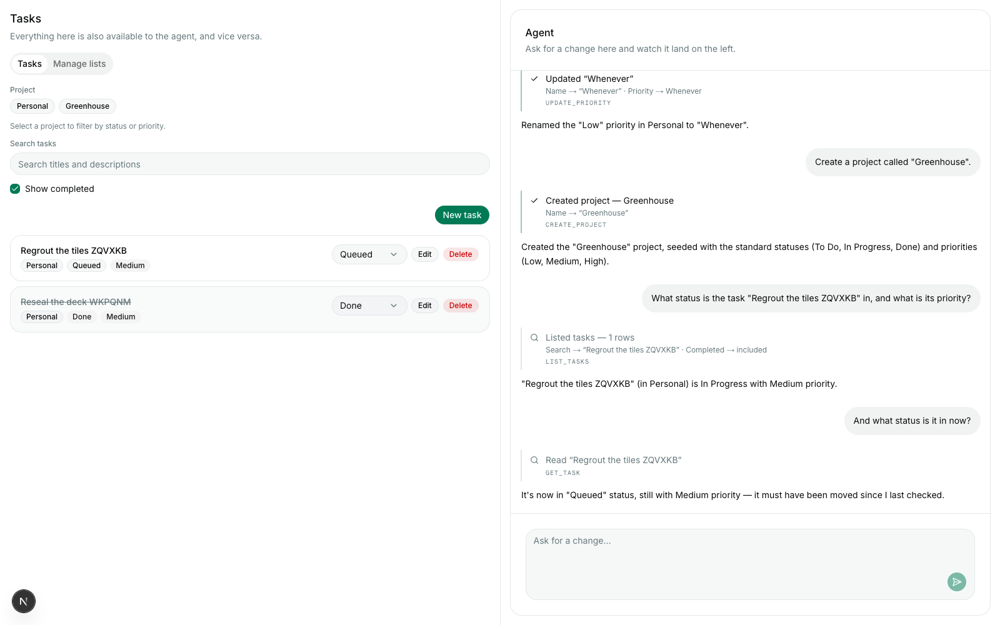

### The overlapping case: the UI writes while the agent turn is in flight

The sequenced case above is deterministic but tidy. The overlapping one is the
scenario the criterion is really about, and it was run separately on a fresh
task, `Rewire the lamp JHTVBD`:

```
04:10:39  A: agent turn sent — "Move the task Rewire the lamp JHTVBD to Done."
04:10:39  B: UI status select → In Progress   (same second; A's composer was disabled, i.e. the turn was in flight)
04:10:49  A: turn settled
```

The agent's own summary confirms which write the database saw first — it read
*In Progress*, a value that did not exist when the turn started:

> **Moved "Rewire the lamp JHTVBD" from In Progress to Done.**

Postgres arbiter: `status: 'Done'`. The later of the two writes won; nothing was
locked, merged, or rejected.

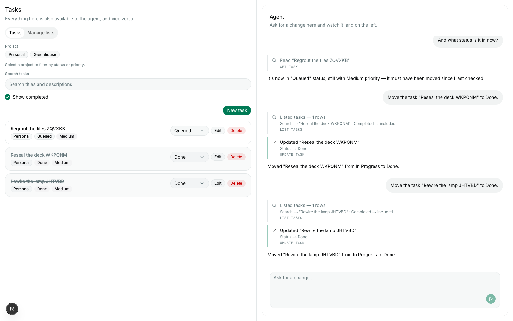

**Honest scoping note.** "Around the same time" here means *turn-overlapping*,
not millisecond-simultaneous: the two writes were issued into an overlapping
window but the database still serialised them a few seconds apart, because the
agent has to read before it writes. Forcing a true sub-millisecond collision
through a live model is not something this harness can do deterministically.
What the criterion asks for — no locking, no conflict surface, later write wins
— is what the implementation provides by construction (unconditioned row
updates, no version column, no `SELECT … FOR UPDATE`) and is consistent with
everything observed here. The stronger claim, that a genuine simultaneous
collision resolves this way, is **not** proven by this packet.

### US-G3.2 — both interfaces show the same converged state

After the overlapping race, with neither page reloaded:

| | Session A (agent + UI) | Session B (UI only, no eve stream) |
| --- | --- | --- |
| `Rewire the lamp JHTVBD` | Done | Done |
| `Reseal the deck WKPQNM` | Done | Done |
| `Regrout the tiles ZQVXKB` | Queued | Queued |
| time to converge | already Done at the first observation after the turn settled (`onEvent`) | within 4s (poll backstop) |
| `task-list-error` elements | 0 | 0 |


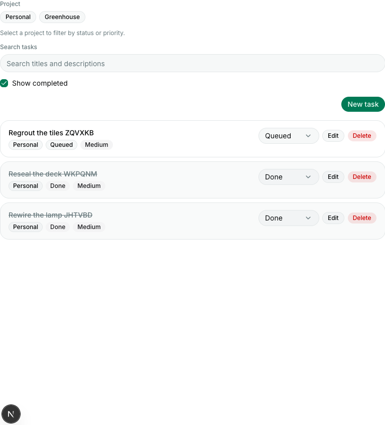

The two panes are identical row for row, chip for chip, and matched Postgres at
that moment. (One later correction for the record: the last thing this run did
was move `Regrout the tiles ZQVXKB` to Done as the mutating half of the network
capture below, so
[`final-database-state.txt`](./final-database-state.txt) — taken after that —
shows all three tasks Done, not the Queued in the table above. The screenshots
are the earlier, converged state.)

**Result: pass (3.1 and 3.2).**

---

## Supporting evidence: the liveness is event-driven, not a poll

US-G1's criterion is satisfied by *any* mechanism that updates the pane, and a
sufficiently aggressive poll would satisfy it while being a bad implementation.
Two `agent-browser network requests --filter /api/` captures, taken in the same
session, separate the two:

| Turn | total `/api/` requests | of which `/api/tasks` |
| --- | --- | --- |
| Read-only — *How many tasks are in the Personal project?* | 3 | **0** |
| One mutation — *Move the task "Regrout the tiles ZQVXKB" to Done.* | 4 | **1** |

Captures: [`manual-network-readonly.json`](./manual-network-readonly.json),
[`manual-network-mutating.json`](./manual-network-mutating.json).

The read-only control is the load-bearing half. A full agent turn ran, streamed,
and answered, and the task query was **not** refetched once — so invalidation is
keyed on *mutating tool names*, not on stream activity. One mutation produced
exactly one task refetch. An implementation that invalidated per stream delta
would have produced tens to hundreds in the first row.

The corroborating suite's own capture of the same two turns, on the production
build and the test database, lands in the same place — 0 task refetches on the
read-only turn, a handful on the mutating one:

| Turn | total `/api/` requests | of which `/api/tasks` |
| --- | --- | --- |
| Read-only ([`network-readonly.json`](./network-readonly.json)) | 1 | **0** |
| One mutation ([`network-mutating.json`](./network-mutating.json)) | 5 | **2** |

---

## Corroboration: the automated suite

`tests/e2e/07-live-sync.test.ts` was re-run from a clean `eve build` +
`next build`, against the separate Neon **test** database and a `next start`
production server — a different topology from the manual run above, on
different data. Output: [`07-live-sync.txt`](./07-live-sync.txt).

```
✔ US-G1.1: an agent-created task appears in the left pane without a reload (29142.188ms)
✔ US-G1.2: statuses, priorities and projects update live too (37985.906625ms)
✔ US-G2: a UI change is visible to the agent's very next answer (14669.429917ms)
✔ US-G3.1: last write wins when the UI and the agent edit the same task (44533.52025ms)
✔ US-G3.2: overlapping edits converge, with no error or lock state (43707.933667ms)
✔ Phase 6: onEvent invalidation does not cause a fetch storm (21961.796666ms)
ℹ tests 6   pass 6   fail 0   duration_ms 203003.5   EXIT=0
```

**6 of 6 green**, first attempt, no retries. This is a fresh run made for this
packet, not the implementation run's output.

Its own screenshots, written by that run (dark theme, 1440×900 — a different
browser session from the manual pass above):
[`g1-task-live.png`](./g1-task-live.png),
[`g1-lists-live.png`](./g1-lists-live.png),
[`g3-session-a.png`](./g3-session-a.png),
[`g3-session-b.png`](./g3-session-b.png).

The suite is a stricter instrument than the manual pass in one respect and a
weaker one in another. Stricter: it never calls `reload()` anywhere by
construction, and it asserts against Postgres rather than against pixels.
Weaker: a bounded `wait` cannot distinguish "invalidated correctly" from "the
30s poll happened to fire inside the window" — which is why the read-only
network control above, and `tests/unit/chat/tool-invalidation.test.ts`'s exact
tool → query-family mapping, are the parts of the evidence that actually pin the
mechanism.

The EVE evals ([`eval.txt`](./eval.txt), [`eval-strict.txt`](./eval-strict.txt))
are carried over from the implementation run. They grade the agent's *prose*
and are not evidence for any US-G1…G3 criterion, which are all about effects;
they are listed here only because they are part of the phase's exit criteria.

---

## What this packet does not claim

- **US-G4 is untested.** Parity across the whole capability set is Phase 7's
  scope. Nothing here should be read as evidence for it.
- **A true simultaneous write collision is not demonstrated** — see the scoping
  note under US-G3.1.
- **The manual run used the dev database and `next dev`.** The production
  topology is covered by the corroborating suite, not by the screenshots.
- **Latencies are polled at 1-second resolution** over the `agent-browser` CLI.
  A "0s" figure means "already true on the first poll", not "measured
  sub-second".
